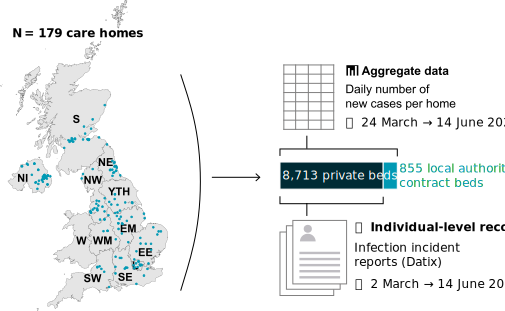

Peter Dutey Magni, Researcher$^{1,2}$ Haydn Williams, Data manager$^{3}$ Arnoupe Jhass, General Practitioner$^{4}$ Greta Rait, Professor$^4$ Fabiana Lorencatto, Senior researcher$^5$ Harry Hemingway,$^{1,2,6}$ Andrew Hayward,$^{7}$ Laura Shallcross$^{1,2*}$

$^1$ Institute of Health Informatics, University College London, London, UK

$^2$ Health Data Research UK, University College London, London, UK

$^3$ Four Seasons Health Care Group, Norcliffe House, Station Road, Wilmslow, Cheshire, UK

$^4$ Primary Care & Population Health, University College London, London, UK

$^5$ University College London Hospitals NIHR Biomedical Research Centre, London, UK

$^6$ Centre for Behaviour Change, University College London, London, UK

$^7$ Institute of Epidemiology & Health Care, University College London, London, UK

$*$ Corresponding author

Peter Dutey-Magni p.dutey-magni@ucl.ac.uk

Haydn Williams haydn.williams@fhscgroup.com

Arnoupe Jhass a.jhass@ucl.ac.uk

Greta Rait g.rait@ucl.ac.uk

Lorencatto, Fabiana f.lorencatto@ucl.ac.uk

Harry Hemingway h.hemingway@ucl.ac.uk

Andrew Hayward a.hayward@ucl.ac.uk 

Laura Shallcross l.shallcross@ucl.ac.uk 


```{r setup, include=FALSE}
knitr::opts_chunk$set(echo = FALSE, message=FALSE)
knit_output_pdf <- F
if(knit_output_pdf){
  options(knitr.table.format = "pdf")
} else {
  options(knitr.table.format = "pandoc")
}
source("../.Rprofile")
devtools::load_all()
load_data()
library(dplyr)
library(lubridate)
library(kableExtra)
library(captioner)
library(survival)
library(survminer)
library(ggplot2)
library(finalfit)
# override the finalfit cox PH modelling which defaults to Efron ties
# using Breslow ties instead
# coxphmulti <- function (.data, dependent, explanatory) {
#     requireNamespace("survival")
#     coxph(as.formula(paste0(dependent, "~", paste(explanatory, 
#         collapse = "+"))), data = .data, ties = "breslow")
# }
# assignInNamespace("coxphmulti",coxphmulti,ns="finalfit")


knit_output_pdf <- F
if(knit_output_pdf){
  options(knitr.table.format = "pdf")
} else {
  options(knitr.table.format = "pandoc")
}

date_min <- as.Date("2020-03-02")
date_max <- as.Date("2020-06-14")
date_min_tallies = as.Date("2020-03-24")
date_max_tallies = as.Date("2020-06-14")
date_min_cox_mortality <- as.Date("2020-04-01")

```

```{r init_data}

tline <- dplyr::bind_rows(timelines$timeline)
stopifnot(unique(tline$date_end)>=date_max)
tline <- filter(tline, between(date, date_min, date_max)) %>% 
  mutate(home_type = factor(home_type, c("Residential", "Nursing"))) %>% 
  mutate(
    user_type2 = as.factor(case_when(
      user_type %in% c("General", "Elderly") ~ "General/elderly",
      user_type == "Dementia" ~ "Dementia",
      TRUE ~ NA_character_ 
      )),
    admission_type2 = case_when(
      admission_type %in% c("Continuing Care", "Independent Living") ~ "Continuing care/independent living", 
      TRUE ~ admission_type
    )) %>% 
  mutate(
    user_type2 = relevel(user_type2, "General/elderly")
  )

home_inclusion <- unique(tline$home_code)

reference_homes <- reference_homes %>% 
  filter(home_code %in% home_inclusion) %>% 
  left_join(select(filter(beds, year=="2020"), -year)) %>% 
  mutate(staff_to_bed_ratio = staff_total/beds,
         carer_to_bed_ratio = (staff_care_assistants + staff_nurses)/beds,
         bed_tot_category = cut(.$beds, 
           breaks = seq(20,100,25), right = F, 
           paste0(seq(20, 80, 25), "–", seq(34, 94, 25), " beds"))
         ) %>% 
  mutate(staff_to_bed_ratio_g5 = cut(
    staff_to_bed_ratio, c(min(staff_to_bed_ratio)-.001,
    quantile(staff_to_bed_ratio, seq(.2, .8, .2)),
    max(staff_to_bed_ratio))))

homes_country <- select(reference_homes, home_code, postcode) %>% 
  left_join(transmute(reference_geography, postcode, 
                      country, region_england = region,
                      uk_imd_england_quintile), by = "postcode") %>% 
  mutate(region_UK = if_else(country == "England", region_england, country)) %>% 
  select(-postcode)
reference_homes <- left_join(reference_homes, homes_country)
rm(homes_country)

incidents <- incidents %>% 
  filter(dplyr::between(incident_date, date_min, date_max)) %>% 
  filter(home_code %in% home_inclusion)

desc_before_exclusions <- list()
desc_before_exclusions$nrow_incidents <- nrow(incidents)
desc_before_exclusions$missing_id <- sum(grepl("^MISSING", incidents$resident_id))
desc_before_exclusions$missing_id_pct <- mean(grepl("^MISSING", incidents$resident_id))*100
desc_before_exclusions$link_fail <- sum(!incidents$resident_id[
  which(!grepl("^MISSING", incidents$resident_id))] %in% unique(residents$resident_id))
desc_before_exclusions$link_fail_pct <- tbrounding(
  sum(!incidents$resident_id[
    which(!grepl("^MISSING", incidents$resident_id))] %in% unique(residents$resident_id)) / 
    nrow(incidents)*100) 


# removing erroneous incident reports (no identifier or not linking to residents file) 
incidents <- filter(incidents, !grepl("^MISSING", resident_id)) %>% 
  filter(resident_id %in% unique(residents$resident_id))

new_cases <- filter(new_cases, between(date, date_min, date_max_tallies)) %>% 
    filter(home_code %in% home_inclusion)

approx_occupancy <- tline %>% 
  group_by(home_code, date) %>% 
  summarise(
    occupancy = sum(tidyr::replace_na(rday, 0)),
    susceptible_symptomatic = sum(susceptible_symptomatic, na.rm = T),
    susceptible_confirmed = sum(susceptible_confirmed, na.rm = T))
approx_occupancy <- merge(
  tibble(date = seq(date_min, date_max, 1)),
  tibble(home_code = home_inclusion),
  all = TRUE) %>% 
  left_join(approx_occupancy)

occupancy_interpolated <- resident_days_linear_approx() #%>% 
home_mean_occupancy <- occupancy_interpolated  %>% 
  filter(between(date, as.Date("2020-01-01"), as.Date("2020-03-14"))) %>%
  group_by(home_code) %>% 
  summarise(mean_occupancy = mean(occupancy, na.rm = T))  

reference_homes <- reference_homes %>% 
  left_join(home_mean_occupancy) %>% 
  mutate(pct_occupancy = mean_occupancy/beds,
         occ_bedroom_ratio = mean_occupancy/no_bedrooms)


reference_homes <- reference_homes %>% 
  mutate(occ_bedroom_ratio_g5 = cut(occ_bedroom_ratio, seq(0.2, 1.2, .2)),
         occ_bedroom_ratio_g6 = cut(occ_bedroom_ratio, seq(0.25, 1.2, .15)),
         region_UK = as.factor(region_UK)) %>% 
  mutate(occ_bedroom_ratio_g6 = relevel(occ_bedroom_ratio_g6, '(0.7,0.85]'),
         occ_bedroom_ratio_g5 = relevel(occ_bedroom_ratio_g5, '(0.8,1]'),
         region_UK <- relevel(region_UK, "Scotland")) 

residents_overview <- tline %>% 
  filter(rday==1) %>%
  mutate(ageg = cut_age_denary(compute_age(dob, date_min), age.min = 75, age.max = 95)) %>% 
  group_by(resident_id, home_code, ageg, gender, 
           admission_type2, home_type, user_type2, status) %>% 
  summarise(resident_days = sum(rday),
            susceptible_symptomatic_days = sum(susceptible_symptomatic),
            susceptible_confirmed_days = sum(susceptible_confirmed),
            symptomatic = max(-susceptible_symptomatic+1, na.rm = T),
            confirmed = max(-susceptible_confirmed+1, na.rm = T),
            start_date = min(date, na.rm = T),
            stop_date = max(date, na.rm = T),
            start_int = as.numeric(min(date, na.rm = T) - date_min),
            stop_int = as.numeric(max(date, na.rm = T)- date_min)
    ) %>% 
  ungroup() %>% 
  mutate(covid_status = case_when(
    symptomatic==0 & confirmed == 0 ~ "Uninfected",
    symptomatic==1 & confirmed == 0 ~ "Symptomatic (not confirmed)",
    symptomatic==0 & confirmed == 1 ~ "Asymptomatic confirmed",
    symptomatic==1 & confirmed == 1 ~ "Symptomatic confirmed"
  )) %>% 
  mutate(
    covid_status = factor(
      covid_status, 
      levels = c("Uninfected", 
                 "Symptomatic (not confirmed)",
                 "Asymptomatic confirmed", 
                 "Symptomatic confirmed"))) %>% 
  left_join(
    select(reference_homes, home_code, country, 
           region_UK, staff_to_bed_ratio,
           staff_to_bed_ratio_g5, carer_to_bed_ratio,
           bed_tot_category, beds,  pct_occupancy,
           mean_occupancy, no_bedrooms, staff_total,
           uk_imd_england_quintile,
           occ_bedroom_ratio, occ_bedroom_ratio_g5,
           occ_bedroom_ratio_g6)) %>% 
  left_join(distinct(select(incidents, 
                            resident_id,
                            starts_with("covid_first")))) 

home_first_case <- bind_rows(
  new_cases %>% 
    dplyr::filter(tidyr::replace_na(new_deaths_hospital, 0) > 0 |
                    tidyr::replace_na(new_deaths_home, 0)>0 |
                    tidyr::replace_na(new_confirmed_home, 0)>0 |
                    tidyr::replace_na(new_confirmed_hospital, 0)>0
                  ) %>% 
    dplyr::group_by(home_code) %>% 
    dplyr::summarise(first_case_date = min(date),
                     source = "CT"),
  residents_overview %>% 
    dplyr::filter(confirmed == 1) %>% 
    dplyr::group_by(home_code) %>% 
    dplyr::summarise(
      first_case_date = min(covid_first_confirmed, 
                            na.rm = T), 
      source="DAT")
  ) %>% 
  dplyr::group_by(home_code) %>% 
  dplyr::summarise(first_case_date = min(first_case_date)) 


home_outbreak_sensitivity <-  new_cases %>% ungroup() %>% 
  arrange(home_code, date) %>% 
  group_by(home_code) %>% 
  mutate(caserunningtot = cumsum(tidyr::replace_na(new_deaths_hospital, 0)+
                    tidyr::replace_na(new_deaths_home, 0))) %>%
  summarise(one_case = min_non_missing(if_else(caserunningtot>0, date, NA_Date_)),
            two_case = min_non_missing(if_else(caserunningtot>1, date, NA_Date_)),
            five_case = min_non_missing(if_else(caserunningtot>4, date, NA_Date_))) %>% 
  left_join(home_first_case)

residents_episodes <- tline %>% 
  filter(rday==1)  %>% 
  left_join(home_outbreak_sensitivity) %>%
  mutate(
  outbreak = dplyr::case_when(
    date >= first_case_date ~ 1L,
    date < first_case_date ~ 0L,
    TRUE ~ 0L
  )
  # outbreak = dplyr::case_when(
  #   date >= two_case ~ 1L,
  #   date < two_case ~ 0L,
  #   TRUE ~ 0L
  # )
  # outbreak = dplyr::case_when(
  #   date >= five_case ~ 1L,
  #   date < five_case ~ 0L,
  #   TRUE ~ 0L)
  ) %>% 
  group_by(resident_id, home_code, dob, gender, 
           status, home_type, user_type2,
           susceptible_symptomatic, 
           susceptible_confirmed,
           outbreak) %>% 
  summarise(entry_date = min(date),
            exit_date = max(date)+.99,
            resident_days = sum(rday),
            susceptible_symptomatic_days = sum(susceptible_symptomatic),
            susceptible_confirmed_days = sum(susceptible_confirmed)) %>% 
  mutate(date1 = as.numeric(entry_date - date_min),
         date2 = as.numeric(exit_date - date_min),
         ageg = cut_age_denary(compute_age(dob, date_min), age.min = 75, age.max = 95)) %>% 
  mutate(symptomatic = -susceptible_symptomatic+1,
         confirmed = -susceptible_confirmed+1,
         symptomatic_confirmed = (-susceptible_symptomatic+1)*(-susceptible_confirmed+1),
         date2 = if_else(date1 == date2, date2 + .2, date2)) %>% 
  mutate(covid_status = case_when(
    symptomatic==0 & confirmed == 0 ~ "Uninfected",
    symptomatic==1 & confirmed == 0 ~ "Symptomatic (not confirmed)",
    symptomatic==0 & confirmed == 1 ~ "Asymptomatic confirmed",
    symptomatic==1 & confirmed == 1 ~ "Symptomatic confirmed"
  )) %>% 
  mutate(
    covid_status = factor(
      covid_status, 
      levels = c("Uninfected", "Symptomatic (not confirmed)",
                 "Asymptomatic confirmed", "Symptomatic confirmed")),
    ageg = cut_age_denary(compute_age(dob, date_min), 
                          age.min = 75, age.max = 95))   %>% 
  left_join(
    select(reference_homes, home_code, country, region_UK,
           staff_to_bed_ratio, staff_to_bed_ratio_g5, 
           carer_to_bed_ratio, bed_tot_category, 
           beds, pct_occupancy, no_bedrooms, uk_imd_england_quintile,
           occ_bedroom_ratio, occ_bedroom_ratio_g5, occ_bedroom_ratio_g6)) %>% 
  group_by(resident_id) %>% 
  mutate(death_status = if_else(
    date1 == max(date1),
    as.integer(status == "Deceased"),
    0L
  )) %>% ungroup()  

residents_episodes <- mutate(
  residents_episodes, 
  gender = as.factor(gender),
  uk_imd_england_quintile = factor(
    uk_imd_england_quintile,
    levels = c('3', '1 - least deprived', '2',
               '4', '5 - most deprived')),
  bed_to_staff_ratio = 1/staff_to_bed_ratio
)

residents_episodes <- dplyr::mutate(
  residents_episodes,
  covid_status_outbreak = as.factor(case_when(
    covid_status == "Uninfected" & outbreak == 0 ~ "0 Uninfected (other home)",
    covid_status == "Symptomatic (not confirmed)" &
      outbreak==0 ~ "1 Symptomatic not confirmed  (other home)",
    covid_status == "Uninfected" & outbreak == 1 ~ "2 Uninfected (outbreak home)",
    covid_status == "Symptomatic (not confirmed)" &
      outbreak==1 ~ "3 Symptomatic not confirmed  (outbreak home)",
    covid_status == "Asymptomatic confirmed" ~ "4 Confirmed asymptomatic",
    covid_status == "Symptomatic confirmed" ~ "5 Confirmed symptomatic"
  )))

residents_episodes$covid_status_outbreak_digit <- as.factor(
  as.numeric(residents_episodes$covid_status_outbreak)-1)
residents_episodes <- bind_cols(
  residents_episodes,
  as_tibble(model.matrix(~covid_status_outbreak_digit, residents_episodes)[ ,-1])
)

residents_episodes_short <- residents_episodes %>% 
  filter(exit_date > date_min_cox_mortality) %>% 
  mutate(date1 = if_else(
    entry_date >= date_min_cox_mortality,
    date1,
    as.numeric( date_min_cox_mortality - date_min),
  ))


# CARE HOME AGGREGATES
home_total_confirmed_DAT <- filter(residents_overview, !is.na(covid_first_confirmed)) %>% 
  filter(between(covid_first_confirmed, date_min_tallies, date_max_tallies)) %>% 
  group_by(home_code) %>% 
  summarise(DAT_confirmed = tidyr::replace_na(n_distinct(resident_id), 0))
home_total_confirmed_CT <- new_cases %>% group_by(home_code) %>% 
  summarise(CT_confirmed = sum(tidyr::replace_na(new_confirmed_home, 0) + 
                                 tidyr::replace_na(new_confirmed_hospital, 0)))

res_counts <- residents_overview %>% 
  group_by(home_code) %>% 
  summarise(unique_residents = n_distinct(resident_id),
            total_rdays = sum(resident_days))

desc_homes <- reference_homes %>% 
  left_join(res_counts, by = "home_code") %>%
  mutate(Scope = paste("FSHCG", country)) %>% 
  group_by(Scope) %>% 
  summarise(., 
            `Total homes` = n_distinct(home_code),
            `Total beds` = sum(beds),
            `Total contract beds` = sum(contract_beds, na.rm = T),
            `Total residents (excl. contract beds)` = sum(unique_residents, na.rm = T))

desc_national <- tibble(
  Scope = c("England", "Scotland (2017)", "Northern Ireland"),
  `Total homes` = c(9400, 1142, 483),
  `Total beds` = c(45000, 40926, 16095),
  `Total contract beds` = NA_integer_,
  `Total residents` = c(NA, 35989, NA)
)

home_total_confirmed <- distinct(reference_homes, home_code, home_name_clickview, 
                                 country, region_UK, staff_to_bed_ratio, carer_to_bed_ratio, 
                                 bed_tot_category, beds, pct_occupancy, no_bedrooms, 
                                 occ_bedroom_ratio, occ_bedroom_ratio_g5, occ_bedroom_ratio_g6,
                                 younger_person, residential_general, residential_dementia,
                                 nursing_general,nursing_dementia) %>% 
  left_join(res_counts, by = "home_code") %>% 
  left_join(home_total_confirmed_CT) %>% 
  left_join(home_total_confirmed_DAT) %>% 
  mutate(CT_confirmed = tidyr::replace_na(CT_confirmed, 0),
         DAT_confirmed = tidyr::replace_na(DAT_confirmed, 0))

home_zero_confirmed <- home_total_confirmed %>% 
  group_by(region_UK) %>% 
  summarise(`Total homes` = n(),
            zero_datix = sum(DAT_confirmed == 0),
            pct_datix = sum(DAT_confirmed == 0)/n(),
            zero_CT = sum(CT_confirmed == 0) ,
            pct_CT =  sum(CT_confirmed == 0)/n()) %>% 
  arrange(-pct_datix)

desc_homes <- bind_rows(desc_homes, desc_national) 
```

```{r km_objects}

residents_ct <- tibble(date = seq(date_min, date_max_tallies, 1)) %>% 
  left_join(select(new_cases, date, home_code, 
                     new_confirmed_home, new_confirmed_hospital,
                     new_symptomatic_home, new_symptomatic_hospital,
                     new_deaths_home, new_deaths_hospital)) %>% 
  filter(!is.na(home_code)) %>% 
  left_join(distinct(reference_homes, home_code, home_name_datix, postcode, 
                     staff_total, nursing_dementia, nursing_general, 
                     residential_dementia, residential_general, younger_person)) %>% 
  left_join(select(reference_geography, postcode, region_UK)) %>% 
  left_join(occupancy_interpolated) %>% 
  mutate(new_symptomatic = tidyr::replace_na(new_symptomatic_home, 0) + 
           tidyr::replace_na(new_symptomatic_hospital, 0),
         new_confirmed = tidyr::replace_na(new_confirmed_home, 0) + 
           tidyr::replace_na(new_confirmed_hospital, 0),
         new_deaths = tidyr::replace_na(new_deaths_home, 0)  +
           tidyr::replace_na(new_deaths_hospital, 0)
         ) %>%   
  arrange(home_code, date) %>% 
  group_by(home_code) %>% 
  mutate(I_symptomatic = total_cases_in_home(occupancy, new_symptomatic, date),
         I_confirmed = total_cases_in_home(occupancy, new_confirmed, date)) %>% 
  ungroup()
 

km_ct_residents_deaths <- residents_ct %>% 
  group_by(date) %>% 
  summarise(
    deaths = sum(new_deaths),
    occupancy = sum(occupancy)
  ) %>% 
  km_ct_estimator(df = ., t = date, d = deaths, 
                  pop = occupancy, subtract_cases = FALSE, overwrite = TRUE) %>% 
  ungroup() %>% 
  mutate(
    St_max = S_t^exp(1.96*S_t_SElog),
    St_min = S_t^exp(-1.96*S_t_SElog),
    event = "COVID-19-related death"
  )

km_ct_residents_confirmed <- residents_ct %>% 
  group_by(date) %>% 
  summarise(
    confirmed = sum(new_confirmed),
    I_confirmed = round(sum(I_confirmed)),
    occupancy = sum(occupancy)
  ) %>% 
  km_ct_estimator(df = ., t = date, d = confirmed, 
                  pop = (occupancy - I_confirmed), subtract_cases = FALSE, overwrite = TRUE) %>% 
  ungroup() %>% 
  mutate(
    St_max = S_t^exp(1.96*S_t_SElog),
    St_min = S_t^exp(-1.96*S_t_SElog),
    event = "Confirmed infection"
  )

km_ct_residents_symp <- residents_ct %>% 
  group_by(date) %>% 
  summarise(
    symptomatic = sum(new_symptomatic),
    I_symptomatic = round(sum(I_symptomatic)),
    occupancy = sum(occupancy)
  ) %>% 
  km_ct_estimator(df = ., t = date, d = symptomatic, 
                  pop = (occupancy - I_symptomatic), subtract_cases = FALSE, overwrite = TRUE) %>% 
  ungroup() %>% 
  mutate(
    St_max = S_t^exp(1.96*S_t_SElog),
    St_min = S_t^exp(-1.96*S_t_SElog),
    event = "Symptomatic case"
  )

staff_ct <- tibble(date = seq(date_min, date_max_tallies, 1)) %>% 
  left_join(distinct(new_cases, date, home_code, 
                     new_colleague_confirmed, new_colleague_symptomatic)) %>% 
  filter(!is.na(home_code)) %>% 
  left_join(distinct(reference_homes, home_code, home_name_datix, postcode, staff_total, nursing_dementia, nursing_general, residential_dementia, residential_general, younger_person)) %>% 
  left_join(select(reference_geography, postcode, region_UK))  %>% 
  arrange(date) %>% 
  group_by(home_code) %>% 
  mutate(
    new_colleague_confirmed = tidyr::replace_na(new_colleague_confirmed, 0),
    new_colleague_symptomatic = tidyr::replace_na(new_colleague_symptomatic, 0)
    ) %>% 
  mutate(I_symptomatic = total_cases_in_home(staff_total, new_colleague_symptomatic, date),
         I_confirmed = total_cases_in_home(staff_total, new_colleague_confirmed, date)) %>% 
  ungroup()

km_staff_symptomatic <- staff_ct %>% 
  group_by(date) %>% 
  summarise(
    symptomatic = sum(new_colleague_symptomatic),
    I_symptomatic = round(sum(I_symptomatic)),
    staff_total = sum(staff_total)
  ) %>% 
  km_ct_estimator(., t=date, d=symptomatic, pop=(staff_total-I_symptomatic),
                  subtract_cases = FALSE, overwrite = TRUE) %>% 
  ungroup() %>% 
  mutate(
    St_max = S_t^exp(1.96*S_t_SElog),
    St_min = S_t^exp(-1.96*S_t_SElog),
    event = "Symptomatic case"
  )

km_staff_confirmed <- staff_ct %>% 
  group_by(date) %>% 
  summarise(
    confirmed = sum(new_colleague_confirmed),
    I_confirmed = round(sum(I_confirmed)),
    staff_total = sum(staff_total)
  ) %>% 
  km_ct_estimator(., t=date, d=confirmed, pop=(staff_total-I_confirmed),
                  subtract_cases = FALSE, overwrite = TRUE) %>% 
  ungroup() %>% 
  mutate(
    St_max = S_t^exp(1.96*S_t_SElog),
    St_min = S_t^exp(-1.96*S_t_SElog),
    event = "Confirmed infection"
  )

desc_staff <- list()
desc_staff$total_staff <- reference_homes %>% filter(home_code %in% unique(residents_overview$home_code)) %>% .$staff_total %>% sum()

desc_staff$CT_symptomatic_total <- sum(new_cases$new_colleague_symptomatic, na.rm = T)
desc_staff$CT_symptomatic_denom <- sum(km_staff_symptomatic$n_t)

desc_staff[paste0(
  "CT_symptomatic_p", c("", "_lower", "_upper")
)] <- epitools::binom.exact(
  desc_staff$CT_symptomatic_total,
  desc_staff$total_staff)[c("proportion", "lower", "upper")] *100

desc_staff[paste0(
  "CT_symptomatic_IR", c("", "_lower", "_upper")
)] <- epitools::pois.exact(
  desc_staff$CT_symptomatic_total,
  desc_staff$CT_symptomatic_denom)[c("rate", "lower", "upper")] *100000

desc_staff$CT_confirmed_total <- sum(new_cases$new_colleague_confirmed, na.rm = T)
desc_staff$CT_confirmed_denom <- sum(km_staff_confirmed$n_t)
desc_staff[paste0(
  "CT_confirmed_p", c("", "_lower", "_upper")
)] <- epitools::binom.exact(
  desc_staff$CT_confirmed_total,
  desc_staff$total_staff)[c("proportion", "lower", "upper")] *100

desc_staff[paste0(
  "CT_confirmed_IR", c("", "_lower", "_upper")
)] <- epitools::pois.exact(
  desc_staff$CT_confirmed_total,
  desc_staff$CT_confirmed_denom)[c("rate", "lower", "upper")] *100000

```

```{r descriptives}
desc_residents <- list()
desc_residents$DAT_total_residents <- dplyr::n_distinct(residents_overview$resident_id)

#COUNTS
# This is estimated in validation.Rmd
desc_residents$CT_total_residents <- tline %>% 
  dplyr::filter(between(date, date_min_tallies, date_max_tallies) & rday == 1) %>% summarise(n = round(dplyr::n_distinct(resident_id) * 1.123865 + .49)) %>% .$n  

desc_residents$CT_total_residents_england <- tline %>% 
  dplyr::inner_join(select(filter(reference_homes, country == "England"), home_code)) %>%
  dplyr::filter(between(date, date_min_tallies, date_max_tallies) & rday == 1) %>%
  summarise(n = round(dplyr::n_distinct(resident_id) * 1.087621 + .49)) %>% .$n   

desc_residents$CT_total_symptomatic <- sum(new_cases$new_symptomatic_home, na.rm=T) + 
  sum(new_cases$new_symptomatic_hospital, na.rm=T)
desc_residents$CT_total_symptomatic_denom <- sum(km_ct_residents_symp$n_t)
desc_residents[paste0(
  "CT_p_symptomatic", c("", "_lower", "_upper")
)] <- epitools::binom.exact(desc_residents$CT_total_symptomatic,
                            desc_residents$CT_total_residents)[
                              c("proportion", "lower", "upper")
                            ] * 100

desc_residents[paste0(
  "CT_IR_symptomatic", c("", "_lower", "_upper")
)] <- epitools::pois.exact(desc_residents$CT_total_symptomatic,
                            desc_residents$CT_total_symptomatic_denom)[
                              c("rate", "lower", "upper")
                            ] * 100000

desc_residents$CT_total_confirmed <-  sum(new_cases$new_confirmed_home, na.rm = T) + sum(new_cases$new_confirmed_hospital, na.rm = T)
desc_residents$CT_total_confirmed_denom <- sum(km_ct_residents_confirmed$n_t)
 
desc_residents[paste0(
  "CT_p_confirmed", c("", "_lower", "_upper")
)] <- epitools::binom.exact(desc_residents$CT_total_confirmed,
                            desc_residents$CT_total_residents)[
                              c("proportion", "lower", "upper")
                            ] * 100 

desc_residents[paste0(
  "CT_IR_confirmed", c("", "_lower", "_upper")
)] <- epitools::pois.exact(desc_residents$CT_total_confirmed,
                            desc_residents$CT_total_confirmed_denom)[
                              c("rate", "lower", "upper")
                            ] * 100000

desc_residents$CT_total_cdeath <-  sum(new_cases$new_deaths_home, na.rm = T) + sum(new_cases$new_deaths_hospital, na.rm = T)
desc_residents$CT_total_cdeath_denom <- sum(km_ct_residents_deaths$n_t)
 
desc_residents[paste0(
  "CT_p_cdeath", c("", "_lower", "_upper")
)] <- epitools::binom.exact(desc_residents$CT_total_cdeath,
                            desc_residents$CT_total_residents)[
                              c("proportion", "lower", "upper")
                            ] * 100 

desc_residents[paste0(
  "CT_IR_cdeath", c("", "_lower", "_upper")
)] <- epitools::pois.exact(desc_residents$CT_total_cdeath,
                            desc_residents$CT_total_cdeath_denom)[
                              c("rate", "lower", "upper")
                            ] * 100000
    
#INCIDENT REPORTS
desc_residents$unique_residents_incidents <- dplyr::n_distinct(incidents$resident_id)

desc_residents$DAT_total_symptomatic <- n_distinct(filter(incidents, !is.na(covid_first_symptomatic))$resident_id)
desc_residents$DAT_total_symptomatic_denom <- sum(residents_overview$susceptible_symptomatic_days)
desc_residents[paste0(
  "DAT_p_symptomatic", c("", "_lower", "_upper")
)] <- epitools::binom.exact(desc_residents$DAT_total_symptomatic,
                            desc_residents$DAT_total_residents)[
                              c("proportion", "lower", "upper")
                            ] * 100
desc_residents[paste0(
  "DAT_IR_symptomatic", c("", "_lower", "_upper")
)] <- epitools::pois.exact(desc_residents$DAT_total_symptomatic,
                            desc_residents$DAT_total_symptomatic_denom)[
                              c("rate", "lower", "upper")
                            ] * 100000
 
desc_residents$total_tests <- nrow(dplyr::filter(incidents, covid_tested == 1))
desc_residents$unique_residents_tested <- dplyr::filter(incidents, covid_tested == 1) %>% 
  dplyr::summarise(n = n_distinct(resident_id)) %>% .$n
desc_residents$unique_residents_test_result <- dplyr::filter(incidents, !is.na(covid_test_result)) %>% 
  dplyr::summarise(n = n_distinct(resident_id)) %>% .$n
desc_residents$unique_residents_test_result_positive <- dplyr::filter(incidents, covid_test_result == 1) %>%  
  dplyr::summarise(n = n_distinct(resident_id)) %>% .$n

desc_residents$DAT_total_confirmed_denom <- sum(residents_overview$susceptible_confirmed_days)
desc_residents[paste0(
  "DAT_p_confirmed", c("", "_lower", "_upper")
)] <- epitools::binom.exact(desc_residents$unique_residents_test_result_positive,
                            desc_residents$DAT_total_residents)[
                              c("proportion", "lower", "upper")
                            ] * 100

desc_residents[paste0(
  "DAT_IR_confirmed", c("", "_lower", "_upper")
)] <- epitools::pois.exact(desc_residents$unique_residents_test_result_positive,
                            desc_residents$DAT_total_confirmed_denom)[
                              c("rate", "lower", "upper")
                            ] * 100000


# CASE FATALITY AND RELATIVE RISK

desc_residents$DAT_total_deaths <- sum(residents_overview$status == "Deceased")
desc_residents$total_denom <- sum(residents_overview$resident_days)
desc_residents[paste0(
  "DAT_p_death",  c("", "_lower", "_upper")
)] <- epitools::binom.exact(
  desc_residents$DAT_total_deaths,
  desc_residents$DAT_total_residents
)[c("proportion", "lower", "upper")] *100

desc_residents[paste0(
  "DAT_IR_death",  c("", "_lower", "_upper")
)] <- epitools::pois.exact(
  desc_residents$DAT_total_deaths,
  desc_residents$total_denom
)[c("rate", "lower", "upper")] * 100000


desc_residents$DAT_CFR <- residents_overview %>% 
  filter(confirmed == 1) %>% 
  summarise(n = n(),
            y = sum(status == "Deceased"))

desc_residents$DAT_BFR <- residents_overview %>%
  filter(confirmed != 1) %>%
  summarise(n = n(),
            y = sum(status == "Deceased"))

desc_residents$DAT_CFR_RR <- relative_risk(
  desc_residents$DAT_CFR$y, 
  desc_residents$DAT_CFR$n - desc_residents$DAT_CFR$y, 
  desc_residents$DAT_BFR$y, 
  desc_residents$DAT_BFR$n - desc_residents$DAT_BFR$y)
 
desc_residents$DAT_CFR_RR_SE <- relative_risk_SE(
  desc_residents$DAT_CFR$y, 
  desc_residents$DAT_CFR$n - desc_residents$DAT_CFR$y, 
  desc_residents$DAT_BFR$y, 
  desc_residents$DAT_BFR$n - desc_residents$DAT_BFR$y)

desc_residents$DAT_CFR_RR_lower <- exp(log(desc_residents$DAT_CFR_RR) - 1.96 * desc_residents$DAT_CFR_RR_SE)
desc_residents$DAT_CFR_RR_upper <- exp(log(desc_residents$DAT_CFR_RR) + 1.96 * desc_residents$DAT_CFR_RR_SE)

desc_residents[paste0(
  "DAT_CFR_rate", c("", "_lower", "_upper")
)] <- epitools::binom.exact(
  desc_residents$DAT_CFR$y,
  desc_residents$DAT_CFR$n
)[c("proportion", "lower", "upper")] *100

desc_residents[paste0(
  "DAT_BFR_rate", c("", "_lower", "_upper")
)] <- epitools::binom.exact(
  desc_residents$DAT_BFR$y,
  desc_residents$DAT_BFR$n
)[c("proportion", "lower", "upper")] *100


### Homes
desc_residents$total_homes <- n_distinct(home_total_confirmed$home_code)
desc_residents$CT_zero_case <- sum(home_total_confirmed$CT_confirmed == 0)
desc_residents$DAT_zero_case <- sum(home_total_confirmed$DAT_confirmed == 0)


## OUTBREAK HOMES 
desc_residents_outbreak_only <- list()
desc_residents_outbreak_only$outbreak_homes <- unique(
  filter(home_outbreak_sensitivity, !is.na(
    # two_case
    first_case_date
    ) == 1)$home_code
)

desc_residents$DAT_BFR_outbreak_homes <- residents_overview %>%
  filter(home_code %in% desc_residents_outbreak_only$outbreak_homes & confirmed != 1) %>%
  summarise(n = n(),
            y = sum(status == "Deceased"))

desc_residents$DAT_BFR_other_homes <- residents_overview %>%
  filter((!home_code %in% desc_residents_outbreak_only$outbreak_homes) & confirmed != 1) %>%
  summarise(n = n(),
            y = sum(status == "Deceased"))

desc_residents$DAT_BFR_outbreak_homes$RR <- relative_risk(
  desc_residents$DAT_BFR_outbreak_homes$y,
  desc_residents$DAT_BFR_outbreak_homes$n - desc_residents$DAT_BFR_outbreak_homes$y,
  desc_residents$DAT_BFR_other_homes$y, 
  desc_residents$DAT_BFR_other_homes$n - desc_residents$DAT_BFR_other_homes$y)

desc_residents$DAT_BFR_outbreak_homes$RR_SE <- relative_risk_SE(
  desc_residents$DAT_BFR_outbreak_homes$y, 
  desc_residents$DAT_BFR_outbreak_homes$n - desc_residents$DAT_BFR_outbreak_homes$y,
  desc_residents$DAT_BFR_other_homes$y, 
  desc_residents$DAT_BFR_other_homes$n - desc_residents$DAT_BFR_other_homes$y)

desc_residents$DAT_BFR_outbreak_homes$RR_lower <- exp(
  log(desc_residents$DAT_BFR_outbreak_homes$RR) - 
    1.96*desc_residents$DAT_BFR_outbreak_homes$RR_SE
)
desc_residents$DAT_BFR_outbreak_homes$RR_upper <- exp(
  log(desc_residents$DAT_BFR_outbreak_homes$RR) + 
    1.96*desc_residents$DAT_BFR_outbreak_homes$RR_SE
)


desc_residents_outbreak_only$CT_total_beds <- beds %>% 
  filter(year == 2020 & home_code %in% desc_residents_outbreak_only$outbreak_homes) %>% 
  summarise(beds = sum(beds),
            contract_beds = sum(contract_beds))
  
desc_residents_outbreak_only$CT_total_residents <- residents_overview %>% 
  dplyr::filter(home_code %in% desc_residents_outbreak_only$outbreak_homes) %>% 
  dplyr::summarise(total_residents = round(dplyr::n_distinct(resident_id)* 1.122205 + .49)) %>% 
  .$total_residents


desc_residents_outbreak_only$CT_total_confirmed <- new_cases %>% 
  filter(home_code %in% desc_residents_outbreak_only$outbreak_homes) %>% 
  summarise(n = sum(new_confirmed_home, na.rm = T) + sum(new_confirmed_hospital, na.rm = T)) %>% 
  .$n

desc_residents_outbreak_only$CT_total_symptomatic <- new_cases %>% 
  filter(home_code %in% desc_residents_outbreak_only$outbreak_homes) %>% 
  summarise(n = sum(new_symptomatic_home, na.rm = T) + sum(new_symptomatic_hospital, na.rm = T)) %>% 
  .$n

desc_residents_outbreak_only$CT_total_confirmed_denom <- residents_ct %>% 
  filter(home_code %in% desc_residents_outbreak_only$outbreak_homes) %>% 
  summarise(n = sum(occupancy - I_confirmed)) %>% 
  .$n

desc_residents_outbreak_only[paste0(
  "CT_p_confirmed", c("", "_lower", "_upper")
)] <- epitools::binom.exact(desc_residents_outbreak_only$CT_total_confirmed,
                            desc_residents_outbreak_only$CT_total_residents)[
                              c("proportion", "lower", "upper")
                              ] * 100 

desc_residents_outbreak_only[paste0(
  "CT_IR_confirmed", c("", "_lower", "_upper")
)] <- epitools::pois.exact(desc_residents_outbreak_only$CT_total_confirmed,
                           desc_residents_outbreak_only$CT_total_confirmed_denom)[
                             c("rate", "lower", "upper")
                             ] * 100000


desc_residents_outbreak_only$CT_total_symptomatic <-  new_cases %>% 
  filter(home_code %in% desc_residents_outbreak_only$outbreak_homes) %>% 
  summarise(n = sum(new_symptomatic_home, na.rm = T) + sum(new_symptomatic_hospital, na.rm = T)) %>% 
  .$n

desc_residents_outbreak_only$CT_total_symptomatic_denom <- residents_ct %>% 
  filter(home_code %in% desc_residents_outbreak_only$outbreak_homes) %>% 
  summarise(n = sum(occupancy - I_symptomatic)) %>% 
  .$n

desc_residents_outbreak_only[paste0(
  "CT_p_symptomatic", c("", "_lower", "_upper")
)] <- epitools::binom.exact(desc_residents_outbreak_only$CT_total_symptomatic,
                            desc_residents_outbreak_only$CT_total_residents)[
                              c("proportion", "lower", "upper")
                            ] * 100
desc_residents_outbreak_only[paste0(
  "CT_IR_symptomatic", c("", "_lower", "_upper")
)] <- epitools::pois.exact(desc_residents_outbreak_only$CT_total_symptomatic,
                            desc_residents_outbreak_only$CT_total_symptomatic_denom)[
                              c("rate", "lower", "upper")
                            ] * 100000
 
desc_residents_outbreak_only$CT_total_cdeath <-  sum(new_cases$new_deaths_home, na.rm = T) + sum(new_cases$new_deaths_hospital, na.rm = T)
desc_residents_outbreak_only$CT_total_cdeath_denom <- residents_ct %>% 
  filter(home_code %in% desc_residents_outbreak_only$outbreak_homes) %>% 
  summarise(n = sum(occupancy)) %>% 
  .$n

desc_residents_outbreak_only[paste0(
  "CT_p_cdeath", c("", "_lower", "_upper")
)] <- epitools::binom.exact(desc_residents_outbreak_only$CT_total_cdeath,
                            desc_residents_outbreak_only$CT_total_residents)[
                              c("proportion", "lower", "upper")
                            ] * 100 

desc_residents_outbreak_only[paste0(
  "CT_IR_cdeath", c("", "_lower", "_upper")
)] <- epitools::pois.exact(desc_residents_outbreak_only$CT_total_cdeath,
                            desc_residents_outbreak_only$CT_total_cdeath_denom)[
                              c("rate", "lower", "upper")
                            ] * 100000

```

```{r captions}
## TABLES
table_nums <- captioner::captioner(prefix = "Table")

incidence_CT_residents <- table_nums(
  name = "incidence_CT_residents",
  caption =  paste0("Cumulative incidence and rate of SARS-CoV-2 infections in residents according to FSHCG aggregate data (", format(date_min, "%e %b %Y"), "-", format(date_max, "%e %b %Y"), ")"))
supp_epi_CT_oubreak_only <- table_nums(
  name = "incidence_CT_staff",
  caption =  paste0("Cumulative incidence and rate of SARS-CoV-2 infections among staff according to FSHCG aggregate data (", format(date_min, "%e %b %Y"), "-", format(date_max, "%e %b %Y"), ")"))
tab_resident_descriptives <- table_nums(
  name = "tab_resident_descriptives",
  caption = paste0("Characteristics of FSHCG private bed residents by type of care home, sex, age, region and status on study exit (", format(date_min, "%e %b %Y"), "-", format(date_max, "%e %b %Y"), ")"))
tab_CFR_age_sex <- table_nums(
  name = "tab_CFR_age_sex",
  caption =  paste0("All-cause case-fatality rates by age and sex among private residents (n=", 
  formatbm(dplyr::n_distinct(residents_overview$resident_id)),
  "; ", format(date_min, "%e %b %Y"), "-", format(date_max, "%e %b %Y"), ")"))
tab_CoxPH_confirmed <- table_nums(
  name = "tab_CoxPH_confirmed",
  caption =  paste0("Risk factors for confirmed infection in private residents: hazard ratios (HR) from a Cox proportional hazards model (n=", 
  formatbm(dplyr::n_distinct(residents_overview$resident_id)),
  ")"))
tab_CoxPH_death <- table_nums(
  name = "tab_CoxPH_death",
  caption =  paste0("Risk factors for all-cause mortality in private care home residents with and without COVID-19 outbreaks: hazard ratios (HR) from a Cox proportional hazards model (n=", 
  formatbm(dplyr::n_distinct(residents_episodes$resident_id)),
  ", ", format(date_min, "%e %b %Y"), "-", format(date_max, "%e %b %Y"), ")"))
tab_attributable_deaths <- table_nums(
  name = "tab_attributable_deaths",
  caption =  paste0("Model-based estimates of attributable death in private care home residents with and without COVID-19 outbreaks (n=", 
  formatbm(dplyr::n_distinct(residents_episodes$resident_id)),
  ", ", format(date_min, "%e %b %Y"), "-", format(date_max, "%e %b %Y"), ")"))


supp_epi_DAT <- table_nums(
  name = "supp_epi_DAT",
  caption =  paste0("Incidence proportions and rates of SARS-CoV-2 infections amongst residents according to Datix incident reports (", format(date_min, "%e %b %Y"), "-", format(date_max, "%e %b %Y"), ")"))

tab_national_descriptives <- table_nums(
  name = "tab_national_descriptives",
  caption = "Total homes, beds, contract beds, and residents within FSHCG and nationwide")

tab_zero_cases <- table_nums(
  name = "tab_zero_cases",
  caption = paste0("Number and proportion of homes without confirmed cases by UK region (", format(date_min_tallies, "%e %b %Y"), "-", format(date_max_tallies, "%e %b %Y"), ")")
)

## FIGURES
fig_nums <- captioner(prefix = "Figure")

fig_study_diagram <- fig_nums(
  name = "fig_study_diagram",
  caption = paste0("Study overview: location of FSHCG care homes and diagram of data sources")
)

fig_KM_CT_plots <- fig_nums(
  name = "fig_KM_CT_plots",
  caption = paste0("Kaplan-Meier estimates of the cumulative incidence of symptomatic cases, confirmed infections and COVID-19 related deaths in (A) residents (n=",   formatbm(desc_residents$CT_total_residents),
  ") and (B) staff (n=",   formatbm(desc_staff$total_staff),
  ") according to FSHCG aggregate data (", format(date_min_tallies, "%e %b %Y"), "-", format(date_max_tallies, "%e %b %Y"), ")"))

fig_KM_mortality <- fig_nums(
  "fig_KM_mortality",
  caption = paste0("Kaplan-Meier estimates of resident (n=",
  formatbm(dplyr::n_distinct(residents_overview$resident_id)),
  ") survival by SARS-COV-2 case type"))

```


```{r period_prevalence, message=F}
# Cumulative sample counts, directly standardised for
# 11 May to 24 May
# 25 May to 7 June

england_results <- list(
  date_min = as.Date("2020-05-11"),
  date_max = as.Date("2020-06-07"),
  cis_confirmed = 35,
  cis_person_days = 483259
)

england_results$FSHC_confirmed <- new_cases %>% 
  filter(between(date, england_results$date_min, england_results$date_max)) %>% 
  inner_join(filter(reference_homes, country == "England")) %>% 
  summarise(
    n = sum(new_confirmed_home, na.rm = T) + sum(new_confirmed_hospital, na.rm = T)
  ) %>% 
  .$n

england_results$FSHC_resident_days <- filter(km_ct_residents_confirmed,
  between(date, england_results$date_min, england_results$date_max)) %>% 
  summarise(n = sum(n_t, na.rm = T) ) %>% 
  .$n

england_results$results <- epitools::rateratio.wald(
  c(england_results$cis_confirmed,
    england_results$FSHC_confirmed,
    england_results$cis_person_days,
    england_results$FSHC_resident_days))
```

# Abstract


**Background**: Epidemiological data on COVID-19 infection in care homes are scarce. We analysed data from a large provider of long-term care for older people to investigate infection and mortality during the first wave of the pandemic.

**Methods**: Cohort study of 179 UK care homes with  9,339 residents and 11,604 staff. We used manager-reported daily tallies to estimate the incidence of suspected and confirmed infection and mortality in staff and residents. Individual-level electronic health records from 8,713 residents were used to model risk factors for confirmed infection, mortality, and estimate attributable mortality.

**Results**: `r formatbm(desc_residents$CT_total_symptomatic)`/`r formatbm(desc_residents$CT_total_residents)` residents developed COVID-19 symptoms (`r tbrounding(desc_residents$CT_p_symptomatic)`% [95% confidence interval: `r tbrounding(desc_residents$CT_p_symptomatic_lower)`%; `r tbrounding(desc_residents$CT_p_symptomatic_upper)`%]), while `r formatbm(desc_residents$CT_total_confirmed)` residents (`r tbrounding(desc_residents$CT_p_confirmed)`% [`r tbrounding(desc_residents$CT_p_confirmed_lower)`%; `r tbrounding(desc_residents$CT_p_confirmed_upper)`%]) and `r formatbm(desc_staff$CT_confirmed_total)` staff (`r tbrounding(desc_staff$CT_confirmed_p)`% [`r tbrounding(desc_staff$CT_confirmed_p_lower)`%; `r tbrounding(desc_staff$CT_confirmed_p_upper)`%]) had laboratory-confirmed infections. The incidence of confirmed infection was `r tbrounding(desc_residents$CT_IR_confirmed)` [`r tbrounding(desc_residents$CT_IR_confirmed_lower)`; `r tbrounding(desc_residents$CT_IR_confirmed_upper)`] and `r tbrounding(desc_staff$CT_confirmed_IR)` [`r tbrounding(desc_staff$CT_confirmed_IR_lower)`; `r tbrounding(desc_staff$CT_confirmed_IR_upper)`] per 100,000 person-days in residents and staff respectively. `r length(desc_residents_outbreak_only$outbreak_homes)`/`r desc_residents$total_homes` (`r tbrounding(length(desc_residents_outbreak_only$outbreak_homes)/desc_residents$total_homes*100)`%) care homes had at least one COVID-19 infection or COVID-19-related death. Lower staffing ratios and higher occupancy rates were independent risk factors for infection.

`r desc_residents$DAT_CFR$y` of `r desc_residents$DAT_CFR$n` residents with confirmed infection died (case-fatality rate: `r tbrounding(desc_residents$DAT_CFR_rate)`% [`r tbrounding(desc_residents$DAT_CFR_rate_lower)`%; `r tbrounding(desc_residents$DAT_CFR_rate_upper)`%]). Mortality in residents with no direct evidence of infection was two-fold higher in care homes with outbreaks versus those without (adjusted HR 2.2 [1.8; 2.6]).

**Conclusions:** Findings suggest many deaths occurred in people who were infected with COVID-19, but not tested. Higher occupancy and lower staffing levels were independently associated with risks of infection. Protecting staff and residents from infection requires regular testing for COVID-19 and fundamental changes to staffing and care home occupancy.


# Background 

Globally the number of COVID-19 cases continues to increase, with substantially higher rates of infection reported in both care homes and hospitals.[@PHE2020] In the UK, there are an estimated 400,000 residents living in approximately 11,000 care homes for older people, which provide residential care with or without on-site nursing.[@LaingBuisson2019; @Sanford2015] Care home residents are particularly vulnerable to COVID-19 due to older age, high prevalence of comorbidity,[@Zhou2020] and frequent exposure to infection through contact with staff, other residents and contaminated surfaces in the facility. At the peak of the pandemic, deaths recorded in UK care home residents were three times higher than during the preceding year.[@onsDR2020] Staff in UK care homes also had higher aged-standardised rates of COVID-19 related mortality compared to other occupations.[@onsDR2020occ] UK national statistics suggests two-thirds of excess deaths recorded in care home residents in the last 6 months involved COVID-19,[@onsDR2020] but this is likely to be an underestimate because many residents were not tested. Understanding the proportion of excess deaths that can be directly and indirectly attributed to COVID-19 infection is important, to fully assess the impact of the pandemic on care homes.

Public health strategies to protect the public, residents and staff from SARS-CoV-2 include rapid testing, restriction of visitors, and vaccination. Such strategies require knowledge of the burden of and risk factors in residents and staff in care homes, linked to outcomes, which may only be drawn from evidence from the pandemic's first wave. Population-based prevalence surveys and studies based on routine data have demonstrated variation in the incidence of infection and case-fatality between countries,[@Fisman2020; @Hollinghurst2020; @Salcher-Konrad2020] but many people with symptoms were not tested, particularly at the start of the pandemic in the context of limited testing capacity. There is no syndromic surveillance for infection in care homes in England, and widespread regular testing for SARS-CoV-2 using reverse transcriptase polymerase chain reaction (RT-PCR) was not established for staff and residents in care homes until 11 May 2020.[@dhscTesting2020] Prior to this, testing was only available for residents or staff who were admitted to hospital, or as part of Public Health England's (PHE) outbreak investigations which permitted a maximum of five tests per care home. Consequently national estimates of incidence and prevalence based on the first wave of infection (February–July 2020) substantially underestimate the burden of infection in residents and staff in care homes.

To our knowledge, there are no studies which have employed population-level active surveillance (daily monitoring to identify possible cases of COVID-19 in residents and staff) in care homes to investigate the epidemiology and clinical outcomes of both suspected and confirmed COVID-19 infections. We analysed electronic health records from the Four Seasons Health Care Group, one of the UK’s largest for-profit providers of residential and nursing care, with the aim of identifying strategies to protect staff and residents in care homes from future waves of infection. Our objectives were to estimate incidence of and risk factors for infection, and incidence of mortality in the following groups: (A) residents with no evidence of infection; (B) symptomatic residents; (C) asymptomatic residents with confirmed infection; and (D) symptomatic residents with confirmed infection. We also estimated mortality attributable to COVID-19.


# Methods

## Study population and setting

Staff and residents living/working in care homes for older people run by the Four Seasons Healthcare Group (FSHCG) between `r format(date_min, "%e %B")` and `r format(date_max, "%e %B %Y")` were eligible for study inclusion. The FSHCG provides a combination of residential and nursing care (for residents with medical conditions), which is predominantly state-funded. Most residents are permanent, but a small proportion receive temporary (respite) care.

In 2020, there were 9,568 beds, representing 9% of all registered care home beds in England, Scotland and Northern Ireland (supplementary methods). 90% of FSHCG care homes participated in the whole care home testing programme, implying that all staff and residents were tested for COVID-19 at least once between 11 May and 22 June 2020. 


## Data sources

We extracted organisational data, individual-level data for 8,713 residents and aggregate data for all staff and residents (`r fig_nums("fig_study_diagram", display = "cite")`). Electronic records collected by the FSHCG are primarily used for billing and monitoring, but have also been used in previous research.[@Smith2020]

*Individual-level data*

FSHCG collects electronic records on residents occupying 'private' beds, excluding those occupying beds that are 'block contracted' to the local authority (855 beds, see Figure 1). Records includes: dates of entry to and exit from the care home, sex, date of birth, type of stay (residential/nursing) and care (general, dementia, older residents). Individual-level data on incidents including infections are reported via 'Datix': resident names, care home identifier, incident date/time, date of birth, sex, COVID-19 symptoms (9 multiple choices), test results, resident current location (care home/hospital), and death. Individual-level data on residents were linked to Datix reports (supplementary methods), and used to categorise residents' infection status into four groups: (A) residents with no evidence of infection (not tested and/or no symptoms); (B) symptomatic residents (symptoms and not tested or tested negative); (C) asymptomatic residents with confirmed infection (no symptoms but tested positive); and (D) symptomatic residents with confirmed infection (symptoms and tested positive) (supplementary methods). The term 'confirmed' denoted a positive PCR test. Datix was also used to differentiate deaths in hospital from those in the care home, and to identify COVID-19 related deaths. 1,492/1,880 (79%) of Datix reports were successfully linked.

*Aggregate data*

On 24 March FSHCG introduced a new reporting system requiring managers of each care home to report daily tallies in residents (new symptomatic cases, new confirmed infection in facility, new confirmed infection in hospital, deaths related to COVID-19) and staff (new symptomatic cases, new confirmed cases). The number of occupied beds in each care home was reported weekly via the same mechanism. COVID-19 related deaths were defined as death in a resident with confirmed infection or a death attributed to COVID-19 by the coroner. Data on staff deaths were not extracted due to the small number of cases.

Characteristics of each care home (number of beds, region, nursing versus residential care) were obtained from FSHCG. 


```{r FSHCG_map, fig.width=3, fig.height=5, warning=F}
# reference_homes_lat_long <- reference_homes %>% 
#   dplyr::filter(home_code %in% home_inclusion) %>% 
#   dplyr::select(home_code, home_name_datix, postcode) %>% 
#   dplyr::left_join(reference_geography, by = "postcode")
#  
# care_homes_map <- ggplot(UK_country_region_sf)  +
#   geom_sf(size = 0.1) +
#   geom_sf_text(aes(label = ctry_reg_abb), fontface = "bold") +
#   theme_void() +
#   geom_point(data = reference_homes_lat_long, aes(y = latitude, x = longitude),
#              color = "#0099B4FF", size = .5) + # shape = 3
#   ggtitle(paste0(length(home_inclusion), " FSHCG care homes"))
# cairo_ps("map.ps", width = 3, height = 5)
# care_homes_map
# dev.off()
```

```{r study_diagram, fig.width=10, fig.height=5}

```

*Note:* `r paste(paste0(UK_country_region_sf$ctry_reg_abb, ": ", UK_country_region_sf$ctry_reg), collapse = "; ")`.

`r fig_nums("fig_study_diagram")`


## Risk factors

Risk factors considered included individual-level variables (age, sex, general or dementia care, residential versus nursing care) and care home characteristics (number of beds, occupancy, bed-to-staff ratio, UK-wide Index of Multiple Deprivation [@Abel2016]). Baseline care home occupancy was computed by averaging weekly occupancy in January-March 2020, before the first COVID-19 case, in order to calculate a ratio of baseline occupancy to the number of bedrooms, and modelled as a continuous variable. We also estimated the ratio of beds to staff as a continuous variable. 

To adjust for case under-ascertainment, we created a dummy variable indicating care homes that had experienced an outbreak, defined throughout the manuscript as care homes that recorded ≥1 confirmed infection or COVID-19 related death during the study period. This definition was preferred over a standard outbreak definition (≥2 cases linked in time and place) to compensate for poor COVID-19 case-ascertainment during the pandemic due to limited testing. Sensitivity analysis was used to assess the impact on excess mortality of using a more specific outbreak definition (supplementary methods).

## Statistical analysis

*Infection in staff and residents in care homes*

Prevalence, incidence and cumulative incidence were calculated for residents and staff using the aggregate daily tallies. These were the trusted source of information used for national reporting of cases, and encompassed all residents and staff (`r fig_nums("fig_study_diagram", display = "cite")`).[@CQC2020stats] Daily occupancy and numbers of residents at risk of infection were inferred using interpolation and a life table approach, as described in supplementary methods. Daily occupancy was inferred from the weekly report of bed occupancy using linear interpolation. The total number of residents at risk of infection was unknown, so it was approximated in a multiple-decrement life table (supplementary methods). The life table allowed us to compute Kaplan-Meier product limit estimators of the cumulative incidence of symptoms, confirmed infections, and COVID-19 related deaths by day based on the aggregate dataset. The incidence rate ratio for care home (based on aggregate data) versus community infections was estimated by contrasting the cumulative incidence for confirmed cases in England with estimates from a national household survey for the period `r format(england_results$date_min, "%e %B")`-`r format(england_results$date_max, "%e %B %Y")`.[@cisbulletin2020; @cisdata2020] 

Infection incidence was also estimated from the individual-level dataset, but was subject to under-reporting (Table S1b). Due to this, individual-level data were only used to estimate age/sex-specific rates of infection and Cox proportional hazards models testing the association with individual and organisational-level risk factors.


*Mortality, attributable mortality and risk factors*

The aggregate dataset was used to estimate the crude rate of COVID-19 related mortality in residents and individual-level data were used to estimate rates of all-cause mortality and case-fatality by age and gender.

In order to investigate the relationship between COVID-19 infection and excess mortality, we made the assumption that residents in 'non-outbreak' care homes (no record of any confirmed cases or COVID-19 related deaths) had not been exposed to infection, and would therefore not experience excess COVID-19 related mortality.[@Burton2020] We therefore compared all-cause mortality in residents with no evidence of infection (group A) in care homes with and without outbreaks. 

A Cox proportional hazards regression model tested the effect of individual- and care home-level risk factors on all-cause mortality, alongside the effect of the time-variant infection status (groups A-D) and care home outbreak status.  We estimated the attributable fraction of deaths for each infection category in care homes with and without outbreaks, taking the reference category as individuals with no direct evidence of infection (group A) in non-outbreak care homes. This fraction was obtained by using the model to predict the counterfactual mortality, then computing the attributable fraction within study.[@Samuelsen2008] Ninety-five percent confidence intervals for proportions and rates were computed from the exact Poisson and binomial limits. Huber sandwich estimators of variance accounted for the design effect of care home clustering in regression models.

Data were analysed in `R`3.5.0 using the `epitool`[@Aragon2020] and `survival`[@therneau2015] libraries. Computer scripts are available online.[@Dutey2020]

# Results

## Study population

The study included `r formatbm(desc_residents$CT_total_residents)` residents across England, Scotland and Northern Ireland and `r formatbm(desc_staff$total_staff)` staff. `r length(desc_residents_outbreak_only$outbreak_homes)`/`r desc_residents$total_homes` (`r tbrounding(length(desc_residents_outbreak_only$outbreak_homes)/desc_residents$total_homes*100)`%) care homes, totalling `r formatbm(desc_residents_outbreak_only$CT_total_residents)` residents, recorded at least one COVID-19 outbreak in either the individual-level or aggregate datasets.  The mean duration of follow-up for residents and staff was `r round(desc_residents$CT_total_cdeath_denom/desc_residents$CT_total_residents)` days and `r as.integer(date_max_tallies-date_min_tallies)` days respectively in the aggregate dataset, and `r round(mean(residents_overview$resident_days))` days in the individual-level dataset.


## Infection and COVID-19 related mortality (aggregate data)

Care home managers recorded symptoms of infection in  `r formatbm(desc_residents$CT_total_symptomatic)` residents, contributing to an overall cumulative incidence of `r tbrounding(desc_residents$CT_p_symptomatic)`% [`r tbrounding(desc_residents$CT_p_symptomatic_lower)`%; `r tbrounding(desc_residents$CT_p_symptomatic_upper)`%] or an incidence rate of `r tbrounding(desc_residents$CT_IR_symptomatic)` per 100,000 resident-days [`r tbrounding(desc_residents$CT_IR_symptomatic_lower)`; `r tbrounding(desc_residents$CT_IR_symptomatic_upper)`] (Table S1a, Figure 2). An additional `r desc_residents$CT_total_confirmed` residents had a confirmed infection, of whom `r formatbm(sum(new_cases$new_confirmed_hospital, na.rm = T))` were diagnosed in hospital. The cumulative incidence of confirmed infection was `r tbrounding(desc_residents$CT_p_confirmed)`% [`r tbrounding(desc_residents$CT_p_confirmed_lower)`%; `r tbrounding(desc_residents$CT_p_confirmed_upper)`%], with an incidence rate of `r tbrounding(desc_residents$CT_IR_confirmed)` per 100,000 [`r tbrounding(desc_residents$CT_IR_confirmed_lower)`; `r tbrounding(desc_residents$CT_IR_confirmed_upper)`]. The rate of confirmed infections in care homes in England was 13-fold higher in care homes compared to the community prevalence of infection derived from the ONS household COVID-19 infection survey (IRR = `r tbrounding(england_results$results$measure[2,"estimate"])` [`r tbrounding(england_results$results$measure[2,"lower"]) `; `r tbrounding(england_results$results$measure[2,"upper"])`]).[@cisbulletin2020]

Care home managers recorded `r desc_residents$CT_total_cdeath` COVID-19 related resident deaths, equivalent to a crude incidence of `r tbrounding(desc_residents$CT_p_cdeath)`% [`r tbrounding(desc_residents$CT_p_cdeath_lower)`; `r tbrounding(desc_residents$CT_p_cdeath_upper)`] or `r  tbrounding(desc_residents$CT_IR_cdeath)` [`r  tbrounding(desc_residents$CT_IR_cdeath_lower)`; `r  tbrounding(desc_residents$CT_IR_cdeath_upper)`] per 100,000 resident-days. `r tbrounding(sum(new_cases$new_deaths_hospital, na.rm = T)/desc_residents$CT_total_cdeath*100)`% of these deaths took place in hospital (Table S1a).


`r table_nums("incidence_CT_residents")`

| Residents     |  Symptomatic  | Confirmed  |    All homes <br>  COVID-19-related deaths  | Symptomatic  |  Confirmed  | Outbreak homes <br>  COVID-19-related deaths  |
| ------------- | -------------:| -------------:|-------------:|-------------:|-------------:|-------------:|
| Cases      | `r formatbm(desc_residents$CT_total_symptomatic)` |	`r formatbm(desc_residents$CT_total_confirmed)` |	`r formatbm(desc_residents$CT_total_cdeath)` | `r formatbm(desc_residents_outbreak_only$CT_total_symptomatic)` |	`r formatbm(desc_residents_outbreak_only$CT_total_confirmed)` | 	`r formatbm(desc_residents_outbreak_only$CT_total_cdeath)` |
|	$N$ exposed  | `r formatbm(desc_residents$CT_total_residents)`|	`r formatbm(desc_residents$CT_total_residents)`|	 	`r formatbm(desc_residents$CT_total_residents)`| `r formatbm(desc_residents_outbreak_only$CT_total_residents)`|	`r formatbm(desc_residents_outbreak_only$CT_total_residents)`|	`r formatbm(desc_residents_outbreak_only$CT_total_residents)`|	
|	Total exposure (days)| `r formatbm(desc_residents$CT_total_symptomatic_denom)`	|`r formatbm(desc_residents$CT_total_confirmed_denom)`	| `r formatbm(desc_residents$CT_total_cdeath_denom)`	|  `r formatbm(desc_residents_outbreak_only$CT_total_symptomatic_denom)`	|`r formatbm(desc_residents_outbreak_only$CT_total_confirmed_denom)` |`r formatbm(desc_residents_outbreak_only$CT_total_cdeath_denom)` |
|	Incidence proportion (%)  | `r tbrounding(desc_residents$CT_p_symptomatic)` [`r tbrounding(desc_residents$CT_p_symptomatic_lower)`; `r tbrounding(desc_residents$CT_p_symptomatic_upper)`]| `r tbrounding(desc_residents$CT_p_confirmed)` [`r tbrounding(desc_residents$CT_p_confirmed_lower)`; `r tbrounding(desc_residents$CT_p_confirmed_upper)`] | `r tbrounding(desc_residents$CT_p_cdeath)` [`r tbrounding(desc_residents$CT_p_cdeath_lower)`; `r tbrounding(desc_residents$CT_p_cdeath_upper)`] | `r tbrounding(desc_residents_outbreak_only$CT_p_symptomatic)` [`r tbrounding(desc_residents_outbreak_only$CT_p_symptomatic_lower)`; `r tbrounding(desc_residents_outbreak_only$CT_p_symptomatic_upper)`]| `r tbrounding(desc_residents_outbreak_only$CT_p_confirmed)` [`r tbrounding(desc_residents_outbreak_only$CT_p_confirmed_lower)`; `r tbrounding(desc_residents_outbreak_only$CT_p_confirmed_upper)`] | `r tbrounding(desc_residents_outbreak_only$CT_p_cdeath)` [`r tbrounding(desc_residents_outbreak_only$CT_p_cdeath_lower)`; `r tbrounding(desc_residents_outbreak_only$CT_p_cdeath_upper)`] | 
|	Incidence rate (per 100,000 person-days) | `r tbrounding(desc_residents$CT_IR_symptomatic)` [`r tbrounding(desc_residents$CT_IR_symptomatic_lower)`; `r tbrounding(desc_residents$CT_IR_symptomatic_upper)`] |`r tbrounding(desc_residents$CT_IR_confirmed)` [`r tbrounding(desc_residents$CT_IR_confirmed_lower)`; `r tbrounding(desc_residents$CT_IR_confirmed_upper)`] | `r tbrounding(desc_residents$CT_IR_cdeath)` [`r tbrounding(desc_residents$CT_IR_cdeath_lower)`; `r tbrounding(desc_residents$CT_IR_cdeath_upper)`] | `r tbrounding(desc_residents_outbreak_only$CT_IR_symptomatic)` [`r tbrounding(desc_residents_outbreak_only$CT_IR_symptomatic_lower)`; `r tbrounding(desc_residents_outbreak_only$CT_IR_symptomatic_upper)`] |`r tbrounding(desc_residents_outbreak_only$CT_IR_confirmed)` [`r tbrounding(desc_residents_outbreak_only$CT_IR_confirmed_lower)`; `r tbrounding(desc_residents_outbreak_only$CT_IR_confirmed_upper)`] |`r tbrounding(desc_residents_outbreak_only$CT_IR_cdeath)` [`r tbrounding(desc_residents_outbreak_only$CT_IR_cdeath_lower)`; `r tbrounding(desc_residents_outbreak_only$CT_IR_cdeath_upper)`] |


```{r fig_KM_CT_plots, fig.height = 4, fig.width = 12, message=FALSE}

km_ct_residents_symp$y <- (1-km_ct_residents_symp$S_t) * desc_residents$CT_total_residents
km_ct_residents_confirmed$y <- (1-km_ct_residents_confirmed$S_t) * desc_residents$CT_total_residents
km_ct_residents_deaths$y <- (1-km_ct_residents_deaths$S_t) * desc_residents$CT_total_residents
                              
write.csv(km_ct_residents_symp, file = "supp_table_kaplan_meier_residents_symptomatic.csv", row.names = F)
write.csv(km_ct_residents_confirmed, file = "supp_table_kaplan_meier_residents_confirmed.csv", row.names = F)
write.csv(km_ct_residents_deaths, file = "supp_table_kaplan_meier_residents_deaths.csv", row.names = F)

all_km_residents <- bind_rows(
  km_ct_residents_symp,
  km_ct_residents_confirmed,
  km_ct_residents_deaths
)
all_km_residents$Event <- factor(
  all_km_residents$event,
  levels = c(
    "Symptomatic case",
    "Confirmed infection",
    "COVID-19-related death"
  )
)

km_residents_graph <- ggplot(aes(x = date, y = 1-S_t, 
           ymax = 1 - St_max,
           ymin = 1 - St_min,
           color = Event), data = all_km_residents) +
  geom_ribbon(alpha=0.1, linetype = 2 ) +
  geom_path(lwd=1.2) +
  geom_text(aes(label = if_else(
    date == get_monday_date(date),
    formatbm(round((1-S_t) * desc_residents$CT_total_residents)),
    ""
  )), size = 3, position = position_nudge(y = .02)) +
  scale_y_continuous("Cumulative incidence",
                     breaks = seq(0,1,.04)) +
  ggsci::scale_color_lancet() +
  scale_x_date(name = "Date", 
               breaks = unique(get_monday_date(all_km_residents$date)),
               labels = format.Date(
                 unique(get_monday_date(all_km_residents$date)),
                 "%e %b %Y"
               )) +
  theme_bw()  +
  theme(legend.position = c(0.2, .85),
        legend.background = element_blank(),
        axis.title = element_text(size = 11),
        axis.text = element_text(size = 11),
        axis.text.x = element_text(angle = 30, vjust = 1, hjust=1)) +
  coord_cartesian(ylim = c(0,0.27)) + ggtitle("(A) Residents")

all_km_staff <- bind_rows(
  km_staff_symptomatic,
  km_staff_confirmed
)
all_km_staff$Event <- factor(
  all_km_staff$event,
  levels = c(
    "Symptomatic case",
    "Confirmed infection"
  )
)

km_staff_symptomatic$y <- (1-km_staff_symptomatic$S_t) * desc_staff$total_staff
km_staff_confirmed$y <- (1-km_staff_confirmed$S_t) * desc_staff$total_staff
write.csv(km_staff_symptomatic, file = "supp_table_kaplan_meier_staff_symptomatic.csv", row.names = F)
write.csv(km_staff_confirmed, file = "supp_table_kaplan_meier_staff_confirmed.csv", row.names = F)

km_staff_graph <- ggplot(aes(x = date, y = 1-S_t, 
           ymax = 1 - St_max,
           ymin = 1 - St_min,
           color = Event), data = all_km_staff) +
  geom_ribbon(alpha=0.1, linetype = 2,stat = ) +
  geom_path(lwd=1.2) +
  geom_text(aes(label = if_else(
    date == get_monday_date(date),
    formatbm(round((1-S_t) * desc_staff$total_staff)),
    ""
  )), size = 3, position = position_nudge(y = .02)) +
  ggsci::scale_color_lancet()+
  scale_y_continuous("Cumulative incidence",
                     breaks = seq(0,1,.04)) +
  scale_x_date(name = "Date", 
               breaks = unique(get_monday_date(km_staff_symptomatic$date)),
               labels = format.Date(
                 unique(get_monday_date(km_staff_symptomatic$date)),
                 "%e %b %Y"
               )) +
  theme_bw() +
  theme(legend.position = "none", 
        axis.title = element_text(size = 11),
        axis.text = element_text(size = 11),
        axis.text.x = element_text(angle = 30, vjust = 1, hjust=1)) +
  coord_cartesian(ylim = c(0,0.27)) +  ggtitle("(B) Staff")

km_ct_plots <- ggpubr::ggarrange(
  km_residents_graph,
  km_staff_graph 
)

pdf("figure2.pdf", 11,4)
km_ct_plots
dev.off()
km_ct_plots
```

*Note*: underlying data available on request from authors, subject to permissions from FHSCG.

`r fig_nums("fig_KM_CT_plots")`


Care home managers recorded `r formatbm(desc_staff$CT_symptomatic_total)`/`r formatbm(desc_staff$total_staff)` staff (`r tbrounding(desc_staff$CT_symptomatic_p)`% [`r tbrounding(desc_staff$CT_symptomatic_p_lower)`%; `r tbrounding(desc_staff$CT_symptomatic_p_upper)`%]) experiencing symptoms of infection during the study period, while `r formatbm(desc_staff$CT_confirmed_total)` (`r tbrounding(desc_staff$CT_confirmed_p)`% [`r tbrounding(desc_staff$CT_confirmed_p_lower)`%; `r tbrounding(desc_staff$CT_confirmed_p_upper)`%]) had a confirmed infection (Table S2, `r fig_nums("fig_KM_CT_plots", display = "cite")`).


`r table_nums("incidence_CT_staff")`


|   Staff       |  Symptomatic  |    Confirmed  | 
| ------------- | -------------:| -------------:|
| Cases      | 	`r formatbm(desc_staff$CT_symptomatic_total)`|	`r formatbm(desc_staff$CT_confirmed_total)` |
|	$N$ exposed  | `r formatbm(desc_staff$total_staff)`|	`r formatbm(desc_staff$total_staff)`|
|	Total exposure (days)| `r formatbm(desc_staff$CT_symptomatic_denom)`	|`r formatbm(desc_staff$CT_confirmed_denom)`|
|	Cumulative incidence (%)  | 	`r tbrounding(desc_staff$CT_symptomatic_p)` [`r tbrounding(desc_staff$CT_symptomatic_p_lower)`; `r tbrounding(desc_staff$CT_symptomatic_p_upper)`]	| `r tbrounding(desc_staff$CT_confirmed_p)` [`r tbrounding(desc_staff$CT_confirmed_p_lower)`; `r tbrounding(desc_staff$CT_confirmed_p_upper)`] |
|	Incidence rate (per 100,000 person-days) | `r tbrounding(desc_staff$CT_symptomatic_IR)` [`r tbrounding(desc_staff$CT_symptomatic_IR_lower)`; `r tbrounding(desc_staff$CT_symptomatic_IR_upper)`]| `r tbrounding(desc_staff$CT_confirmed_IR)` [`r tbrounding(desc_staff$CT_confirmed_IR_lower)`; `r tbrounding(desc_staff$CT_confirmed_IR_upper)`] |

Incidence estimates derived from individual-level Datix records are reported in supplementary Table S1b.


## All-cause mortality (individual-level data)

Individual-level data were available for `r formatbm(desc_residents$DAT_total_residents)` (`r tbrounding(desc_residents$DAT_total_residents/desc_residents$CT_total_residents*100)`%) private residents (`r table_nums("tab_resident_descriptives", display = "cite")`), who accounted for `r formatbm(desc_residents$DAT_total_deaths)` all-cause deaths, equivalent to a crude cumulative incidence of `r tbrounding(desc_residents$DAT_p_death)`% [`r tbrounding(desc_residents$DAT_p_death_lower)`%; `r tbrounding(desc_residents$DAT_p_death_upper)`%]. The proportion of resident deaths was two-fold higher in care homes with outbreaks compared to those without outbreaks (22.6% versus 11.2%). 

`r desc_residents$DAT_CFR$y` deaths occurred in residents with confirmed infection, equivalent to an all-cause case-fatality rate in infected residents (Groups C and D) of `r tbrounding(desc_residents$DAT_CFR_rate)`% [`r tbrounding(desc_residents$DAT_CFR_rate_lower)`%; `r tbrounding(desc_residents$DAT_CFR_rate_upper)`%] (Table S4). The case-fatality rate increased with age and was higher in men compared to women.

`r table_nums("tab_resident_descriptives")`

```{r table_resident_descriptives, message = FALSE, results="asis"}

residents_overview <- residents_overview %>% 
  mutate(outbreak = as.integer(home_code %in% desc_residents_outbreak_only$outbreak_homes) ) %>% 
  dplyr::mutate(
    covid_status_outbreak = as.factor(case_when(
    covid_status == "Uninfected" & outbreak == 0 ~ "0 Uninfected (other home)",
    covid_status == "Symptomatic (not confirmed)" &
      outbreak==0 ~ "1 Symptomatic not confirmed  (other home)",
    covid_status == "Uninfected" & outbreak == 1 ~ "2 Uninfected (outbreak home)",
    covid_status == "Symptomatic (not confirmed)" &
      outbreak==1 ~ "3 Symptomatic not confirmed  (outbreak home)",
    covid_status == "Asymptomatic confirmed" ~ "4 Confirmed asymptomatic",
    covid_status == "Symptomatic confirmed" ~ "5 Confirmed symptomatic"
  ))) %>% 
  mutate(outbreak = relevel(as.factor(dplyr::case_when(
    home_code %in% desc_residents_outbreak_only$outbreak_homes ~ "Outbreak homes",
    TRUE ~ "Other homes"
    )), "Outbreak homes"))
 
arsenal::tableby(
  outbreak  ~ Sex + Age  +  `Resident type` + `Admission type`  + `Funding type` +  
    `Infection status by 14 June` + `Status as of 14 June` + `Region/nation` + `Index of Multiple Deprivation`, 
  control = arsenal::tableby.control(test = FALSE, numeric.stats = c("Nmiss", "meansd"), digits = 1L),
  data = mutate(residents_overview,
                Sex = gender,
                Age = ageg,
                `Resident type` = user_type2,
                `Admission type` = admission_type2,
                `Funding type` = home_type,
                `Infection status by 14 June` = covid_status, 
                `Status as of 14 June` = status,
                `Region/nation` = region_UK,
                `Index of Multiple Deprivation` = uk_imd_england_quintile
  )) %>% summary()
```

 
```{r factors_outbreak}
# home_total_confirmed$outbreak <-  as.factor(home_total_confirmed$CT_confirmed>0)
# # factors_outbreak <- glm( 
# #   outbreak ~ staff_to_bed_ratio + bed_tot_category + 
# #     pct_occupancy +occ_bedroom_ratio + region_UK , 
# #   family = binomial(), data = home_total_confirmed)
# # summary(factors_outbreak)
# explanatory = c( "bed_tot_category", "pct_occupancy", "staff_to_bed_ratio",
#                  "occ_bedroom_ratio",
#                  #"younger_person", "residential_general", "factor(residential_dementia)",
#                  # "nursing_general","nursing_dementia", 
#                  "region_UK")
# dependent = "outbreak"
# odds_outbreak <-  finalfit(home_total_confirmed,
#                            dependent, 
#                            explanatory, column = T,
#                            add_dependent_label = F)  
# knitr::kable(odds_outbreak,
#              row.names=FALSE, align=c("l", "l", "r", "r", "r", "r"))
#  
# ggplot(home_total_confirmed, aes(occ_bedroom_ratio, pct_occupancy, colour = outbreak)) +
#   geom_point() +
#   ggsci::scale_color_lancet() +
#   xlab("Ratio mean occupancy:number bedroom") + ylab("Ratio mean occupancy:beds")
```

`r table_nums("tab_CFR_age_sex")`


```{r tab_CFR_age_sex, results="asis"}
CFR_age_sex <- residents_overview %>%
  mutate(Age = ageg, Sex = gender) %>% 
  group_by(Sex, Age) %>% 
  summarise(
    n = n_distinct(resident_id),
    resident_days = sum(resident_days),
    confirmed_infections = sum(confirmed == 1),
    deaths = sum(status == "Deceased"),
    deaths_confirmed = sum(status == "Deceased" & confirmed == 1)) %>% 
  ungroup()

CFR_age_sex <- bind_rows(
  CFR_age_sex,
  colSums(CFR_age_sex[3:7])
) %>% mutate(
  Sex = tidyr::replace_na(Sex, "All"),
  Age = tidyr::replace_na(Age, "")
)

CFR_age_sex <- CFR_age_sex %>% 
  mutate(
    cfr = tbrounding(deaths_confirmed/confirmed_infections*100),
    cfr_lower = tbrounding(epitools::binom.exact(deaths_confirmed, confirmed_infections)$lower*100),
    cfr_upper = tbrounding(epitools::binom.exact(deaths_confirmed, confirmed_infections)$upper*100),
    RR = relative_risk(deaths_confirmed, confirmed_infections - deaths_confirmed,
                       deaths - deaths_confirmed, n - confirmed_infections -(deaths - deaths_confirmed)),
    RR_SE = relative_risk_SE(deaths_confirmed, confirmed_infections - deaths_confirmed,
                       deaths - deaths_confirmed, n - confirmed_infections -(deaths - deaths_confirmed))
  ) %>%  ungroup() %>% 
  transmute(
    Age,
    Sex,
    N = formatbm(n),
    `Confirmed infections` = confirmed_infections,
    `Total deaths` = formatbm(deaths),
    `Deaths in confirmed infections` = deaths_confirmed,
    `Case-fatality rate (%)` = paste0(cfr, " [", cfr_lower, "; ", cfr_upper, "]")
    # `Relative risk` = paste0(
    #   tbrounding(RR, 2), " [",
    #   tbrounding(exp(log(RR) - 1.96 * RR_SE), 2), "; ",
    #   tbrounding(exp(log(RR) + 1.96 * RR_SE), 2), "]"
    # )
  ) 
CFR_age_sex %>%
  kable(align=c("l", "l", "r", "r", "r", "r", "r", "r"))
```


## Factors associated with confirmed infections (individual-level data)

Factors affecting the rate of confirmed cases were investigated in a Cox Proportional Hazard model. Male sex, age $\geq$ 85 years, and residence in a nursing care home (adjusted hazard ratio HR = 1.6 [1.0; 2.4]) were all independently associated with increased risk of confirmed COVID-19 infection (`r table_nums("tab_CoxPH_confirmed", display = "cite")`). After controlling for organisational differences, care home size no longer had a statistically significant association with rates of infection (adjusted HR = 1.7 [0.7; 4.3] for care homes with $\geq$ 70 beds versus <35 beds). Care home baseline occupancy and staffing ratios had the greatest effect on residents' risk of infection. For example, a 10 percentage point increase in the ratio of occupants to bedrooms was associated with a 51% increase in infection (adjusted HR = 1.5 [1.1; 2.1]); and a 10 percentage point increase in the ratio of beds to staff was associated with a 26% increase in infection (adjusted HR = 1.3 [1.1; 1.5]).

`r table_nums("tab_CoxPH_confirmed")`

```{r hazard_ratios_confirmed,  warning=F, results="asis"}
residents_overview$uk_imd_england_quintile <- factor(
  residents_overview$uk_imd_england_quintile,
  levels = c('3', '1 - least deprived', '2', '4', '5 - most deprived'))
residents_overview$bed_to_staff_ratio <- 1/residents_overview$staff_to_bed_ratio

residents_overview$occ_to_staff <- residents_overview$mean_occupancy/residents_overview$staff_total
 
  
# residents_overview <- mutate(residents_overview, gender = as.factor(gender))
# foreign::write.dta(residents_overview, file = "../residents_overview.dta", 
#                    convert.factors = c("labels", "string", "numeric", "codes"))
cph_conf <- coxph(
  Surv(start_int, stop_int, confirmed, type="counting") ~ gender + ageg + home_type + 
    user_type2 + uk_imd_england_quintile + bed_tot_category +
    I(occ_bedroom_ratio-.9) +  I(occ_to_staff-.73)  , #
  cluster = residents_overview$home_code,
  data = residents_overview)
# cox.zph(cph_conf)
# survfit(Surv(time = start_int, time2 = stop_int +1, event = confirmed)~factor(gender), data = residents_overview) %>% ggsurvplot(ylim=c(.85,1), conf.int = T, legend = "right")
# I(occ_to_staff-.75) + I(pct_occupancy-0.877) 
explanatory = c("gender", "ageg", "home_type", "user_type2",  "uk_imd_england_quintile",
                "bed_tot_category", "I(occ_bedroom_ratio-.9)", "I(bed_to_staff_ratio-.85)",
                "cluster(home_code)")
dependent = "Surv(time = start_int, time2 = stop_int+0.01, event = confirmed)"
CPH_confirmed <-  finalfit(residents_overview,
                           dependent,
                           explanatory, column = T,
                           add_dependent_label = F)  %>%     ff_remove_p()
knitr::kable(CPH_confirmed,
             row.names=FALSE, align=c("l", "l", "r", "r", "r", "r"))
```


```{r tablefiller1, results="asis"}
# arsenal::tableby(
#   confirmed  ~ gender + ageg  +  home_type + user_type2 +bed_tot_category + bed_to_staff_ratio +  occ_bedroom_ratio_g6, 
#   control = arsenal::tableby.control(test = FALSE, cat.stats = "countrowpct", digits = 1L),
#   data = residents_overview) %>%  summary()

# residents_overview %>% 
#   mutate(confirmed = as.factor(confirmed)) %>% 
#   summary_factorlist("confirmed", explanatory) %>% kable
```


## Factors associated with all-cause mortality (individual-level data)

Time-dependent Cox proportional hazard models (`r table_nums("tab_CoxPH_death", display = "cite")`) examine the relationship between infection status (groups A–D) and mortality (Figure S3). After controlling for other risk factors, increased mortality was independently associated with older age, male gender (adjusted HR = 1.5 [1.3; 1.6]), and receiving nursing care (adjusted HR = 1.3 [1.1; 1.6]).

We estimated excess mortality in outbreak and non-outbreak care homes, taking individuals with no evidence of infection (group A) in non-outbreak care homes as the reference group. Hazards of all-cause mortality were two-fold higher in Group A – no direct evidence of infection in outbreak versus non-outbreak care homes (adjusted HR = 2.2 [1.8; 2.6]). All-cause mortality was strongly associated with confirmed infection, whether asymptomatic (Group C: adjusted HR = 3.8 [2.3; 6.4]) or symptomatic (Group D: adjusted HR = 14 [11; 18]). In confirmed infections, mortality was significantly higher in individuals with a record of symptoms.

```{r residents_daily}
residents_daily <- tline %>% 
  filter(rday==1)  %>% 
  left_join(home_first_case) %>%
  mutate(outbreak = dplyr::case_when(
    date >= first_case_date ~ 1L,
    date < first_case_date ~ 0L,
    TRUE ~ 0L
  )) %>% 
  group_by(resident_id) %>% 
  mutate(
    death = case_when(
    status == "Deceased" & date == max(date) ~ 1L,
    TRUE ~ 0L
  ),death_Apr = case_when(
    status == "Deceased" & date == max(date) & 
      date >= as.Date("2020-04-01") ~ 1L,
    TRUE ~ 0L
  )) %>% 
  ungroup() %>% 
  mutate(symptomatic = -susceptible_symptomatic+1,
         confirmed = -susceptible_confirmed+1,
         symptomatic_confirmed = (-susceptible_symptomatic+1)*(-susceptible_confirmed+1)) %>% 
  mutate(covid_status_outbreak = as.factor(case_when(
    symptomatic==0 & confirmed == 0 & outbreak == 0 ~ "0 Uninfected (other home)",
    symptomatic==1 & confirmed == 0 & outbreak == 0 ~ "1 Symptomatic not confirmed  (other home)",
    symptomatic==0 & confirmed == 0 & outbreak == 1 ~ "2 Uninfected (outbreak home)",
    symptomatic==1 & confirmed == 0 & outbreak == 1 ~ "3 Symptomatic not confirmed  (outbreak home)",
    symptomatic==0 & confirmed == 1 ~ "4 Confirmed asymptomatic",
    symptomatic==1 & confirmed == 1 ~ "5 Confirmed symptomatic"
  )))
residents_daily$covid_status_outbreak_digit <- as.factor(
  as.numeric(residents_daily$covid_status_outbreak)-1)
residents_daily <- bind_cols(
  residents_daily,
  as_tibble(model.matrix(~covid_status_outbreak_digit, residents_daily)[,-1])
)

```

`r table_nums("tab_CoxPH_death")`

```{r hazard_ratios_death,  warning=F, results="asis"}
# foreign::write.dta(residents_episodes, 
#                    file = "../residents_episodes.dta")
# cph_death <- coxph(
#   Surv(date1, date2, death_status) ~ gender + ageg +
#     home_type + user_type2 + bed_tot_category +
#     uk_imd_england_quintile +
#     I(bed_to_staff_ratio-.85) + I(occ_bedroom_ratio-.9) +
#     covid_status_outbreak_digit1 +
#     covid_status_outbreak_digit2 +
#     covid_status_outbreak_digit3 +
#     covid_status_outbreak_digit4 +
#     covid_status_outbreak_digit5 +
#     + cluster(resident_id),
#   data = residents_episodes)
# cox.zph(cph_death)
# for(i in 8:12){
#   plot(cox.zph(cph_death)[i], col = 2)
# }
explanatory = c(
  "gender", "ageg", "home_type", "user_type2", 
  "bed_tot_category", "uk_imd_england_quintile",
  "I(occ_bedroom_ratio-.9)", "I(bed_to_staff_ratio-.85)",
  "covid_status_outbreak",  "cluster(home_code)")
dependent = "Surv(time = date1, time2 = date2, event = death_status)"

CPH_death <-  finalfit(residents_episodes, dependent, 
                       explanatory, column = T, 
                       add_dependent_label = F)  %>% 
  ff_remove_p() 
knitr::kable(CPH_death, row.names=FALSE, 
             align=c("l", "l", "r", "r", "r", "r"))
```

*Note:* Baseline group = uninfected residents in non-outbreak care homes

```{r tablefiller2, results="asis"}
# residents_overview$death_status <- as.integer(residents_overview$status == "Deceased")
# arsenal::tableby(
#   death_status  ~ gender + ageg  +  home_type + user_type2  + bed_to_staff_ratio + bed_tot_category +  occ_bedroom_ratio_g6 + covid_status_outbreak, 
#   control = arsenal::tableby.control(test = FALSE, cat.stats = "countrowpct", digits = 1L),
#   data = residents_overview) %>%  summary()

# residents_overview %>% 
#   mutate(confirmed = as.factor(confirmed)) %>% 
#   summary_factorlist("confirmed", explanatory) %>% kable
```


```{r fig_KM_mortality,  fig.height = 6, fig.width = 8, message=F}
KM_mortality_by_covid_status <- survfit(
  Surv(time = start_int, time2 = stop_int, event = death_status) ~ covid_status + outbreak, 
  data = mutate(
    residents_overview, 
    death_status = as.integer(status == "Deceased")
  ))
KM_mortality_plot <- ggsurvplot_facet(
  KM_mortality_by_covid_status,
  mutate(residents_overview, 
         death_status = as.integer(status == "Deceased")  ),
  facet.by  = "covid_status",
  legend.labs = c("Non-outbreak home", "Outbreak home"),
  short.panel.labs	 = T, break.x.by	= 7, 
  break.y.by = .1,
  palette = "aaas", conf.int = T,
  scales = "free", ggtheme = theme_bw(), xlim = c(0, 104), 
  xlab  = paste0("Days since ", format(date_min, "%e %b %Y")),
  conf.int.alpha = .15, censor.shape = 124, censor.size = 2, size = 0.5)

KM_mortality_plot <- KM_mortality_plot +  
  scale_x_continuous(name = "Date", 
                     breaks = c(seq(0, 7*50, 7)),
                     labels = format.Date(date_min + seq(0, 7*50, 7), "%e %b %Y" )) +
  theme(axis.text.x = element_text(size = 8, angle = 35, vjust = 1, hjust=1)) 
pdf("figure3.pdf", 8, 6)
KM_mortality_plot
dev.off()
KM_mortality_plot

summary(KM_mortality_by_covid_status)[c("time",  "n.risk", "n.event", "n.censor", "surv", "strata")] %>% 
  as_tibble %>% 
  mutate(infection = gsub("covid_status=", "", gsub(", outbreak=.*", "", strata)),
         outbreak = gsub(".*, outbreak=", "", strata))  %>% 
  select(-strata) %>% 
  write.csv(file = "supp_table_kaplan_meier_indiv_alldeaths.csv", row.names = F)
```

`r fig_nums("fig_KM_mortality")`

## Attributable mortality (individual-level data)

Model-based estimates indicate that 653/1,694 (39%) all-cause deaths were attributable to COVID-19 (Table S7). In care homes with outbreaks only, just 217/653 (33%) deaths attributable to COVID-19 occurred in people with confirmed infection (Groups C and D, Table S7).

`r table_nums("tab_attributable_deaths")`

```{r attributable_deaths, warning=F, message=F, results = "asis"}
cph_death3 <- coxph(Surv(date1, date2, death_status) ~
                    gender+ ageg + home_type + user_type2 + covid_status_outbreak_digit +
                    bed_tot_category + uk_imd_england_quintile +
                    I(occ_bedroom_ratio-.9) + I(bed_to_staff_ratio-.85) +
                    cluster(home_code), data =  residents_episodes)

HRs_covid <- tibble::enframe(cph_death3$coefficients[grep("covid_status_outbreak", 
                                                          names(cph_death3$coefficients))]) %>% 
  transmute(covid_status_outbreak_digit = gsub("covid_status_outbreak_digit", "", name),
            HR = exp(value))
HRs_CI_covid <- as_tibble(exp(confint(cph_death3))[grep("covid_status_outbreak", 
                                                          names(cph_death3$coefficients)),]) %>% 
  rename(HR_lower =  `2.5 %`,
         HR_upper = `97.5 %`)
HRs_CI_covid$covid_status_outbreak_digit <- gsub(
  "covid_status_outbreak_digit", "",
  grep("covid_status_outbreak", names(cph_death3$coefficients), value = T)
) 
HRs_covid <- merge(HRs_covid, HRs_CI_covid)

attributable_deaths <- residents_episodes %>%
  group_by(covid_status_outbreak_digit, covid_status_outbreak) %>%
  summarise(
    rdays = sum(date2-date1),
    deaths = sum(death_status == 1),
    deaths_apr = sum(death_status == 1 & date2 >= 30)
    ) %>% 
  left_join(HRs_covid) %>% 
  mutate(HR = tidyr::replace_na(HR, 1),
           HR_lower = tidyr::replace_na(HR_lower, 1),
           HR_upper = tidyr::replace_na(HR_upper, 1))

# All deaths

death_predictions <- 1-predict(cph_death3, residents_episodes, type = "survival")
att_fractions <- 0
for(i in 1:5) {
  residents_episodes_counterfact <- mutate(
    residents_episodes, 
    covid_status_outbreak_digit = case_when(
      covid_status_outbreak_digit == as.character(i) ~ factor("0", levels = 0:5),
      TRUE ~ covid_status_outbreak_digit)
  )
  death_predictions_counterfactual <- 1 - predict(cph_death3, 
                                                  residents_episodes_counterfact, 
                                                  type = "survival")
  att_fractions[i+1] <- sum(death_predictions - death_predictions_counterfactual) / sum(death_predictions)
}

rm(death_predictions, death_predictions_counterfactual)

attributable_deaths$AF <- att_fractions


# Just for April-June
death_predictions <- 1-predict(cph_death3, residents_episodes_short, type = "survival")
att_fractions <- 0
for(i in 1:5) {
  residents_episodes_counterfact <- mutate(
    residents_episodes_short, 
    covid_status_outbreak_digit = case_when(
      covid_status_outbreak_digit == as.character(i) ~ factor("0", levels = 0:5),
      TRUE ~ covid_status_outbreak_digit)
  )
  death_predictions_counterfactual <- 1 - predict(cph_death3, 
                                                  residents_episodes_counterfact, 
                                                  type = "survival")
  att_fractions[i+1] <- sum(death_predictions - death_predictions_counterfactual) / sum(death_predictions)
}
rm(death_predictions, death_predictions_counterfactual)

attributable_deaths$AF_apr <- att_fractions

attributable_deaths <- bind_rows(attributable_deaths, 
                                 colSums(attributable_deaths[,c("rdays", "deaths", "deaths_apr",
                                                                "AF", "AF_apr")]))
attributable_deaths %>% ungroup() %>% transmute(
  `Infection/outbreak status` = tidyr::replace_na(as.character(covid_status_outbreak), "TOTAL"),
  `Adjusted HR` = paste0(tbrounding(HR,2), " [",
                        tbrounding(HR_lower,2),"; ",
                        tbrounding(HR_upper,2), "]"),
  `Resident-days` = formatbm(rdays),
  `Deaths attributable to COVID-19 (% all-cause deaths)` = round(AF * sum(deaths/2)),
  `Total deaths` = formatbm(deaths),
  `%` = tbrounding(AF*100, 2)
  
  # `Total deaths (April-June)` = formatbm(deaths_apr),
  # `Deaths attributable to COVID-19 (% all-cause deaths April-June)` = paste0(
  #   round(AF_apr * sum(deaths_apr/2)), " (",
  #   tbrounding(AF_apr*100, 2), ")")
) %>% kable(align=c("l", rep("r", 4)))

```


# Discussion

## Main findings 

Across 179 care homes, 22% of residents experienced symptoms while 10% had a laboratory-confirmed infection, with a case-fatality rate of 35.7% across the first wave of the pandemic. Residents with no direct evidence of infection in care homes with outbreaks had twice the mortality of the equivalent group in care homes without outbreaks: less than one-third of deaths attributable to COVID-19 in outbreak care homes were confirmed due to insufficient testing capacity until late in the pandemic. In addition to the need for active surveillance linked to increased testing capacity, higher staff to resident ratios and reduced care home occupancy may be important to reduce the spread of infection.

Our estimates of the prevalence of confirmed COVID-19 infections and deaths in residents are comparable to a large survey of managers of care homes in England.[@onsVivaldi2020] However, both studies are likely to be underestimates due to limited testing, asymptomatic infection[@Salcher-Konrad2020] and moderate sensitivity of PCR testing.[@Kucirka2020] Our estimate of `r tbrounding(desc_residents$DAT_CFR_rate)`% case-fatality in residents with confirmed infection over a mean of 71 days is slightly higher than previous literature,[@Blain2020; @McMichael2020; @Arons2020] but is based on longer follow-up, a larger number of residents, and our study population had higher overall mortality.

Two thirds of care homes in our study reported at least one case of infection or death, in agreement with a recent study from the Lothian region of Scotland which reported that 61% of care homes for older adults had experienced an outbreak.[@Burton2020] This suggests that most outbreaks were identified through FSHCs active surveillance system, and supports our assumption that residents in non-outbreak care homes had not been exposed to infection. This assumption made it possible to estimate mortality attributable to COVID-19.

Our findings of excess deaths in those with no direct evidence of infection may be due to under-ascertainment, direct effects of COVID-19 control measures on delivery of care, and/or indirect effects due to additional disruption caused by the outbreak.  Studies from other healthcare settings[@Lai2020; @Weinberger2020] have highlighted the ways in which COVID-19 has impacted delivery of care associated with excess mortality in individuals who are uninfected. Detailed analysis of cause of death and reasons for hospital admission in care home residents will be important to understand how the pandemic has affected the quality of care in care homes. Our analysis provides a method that could be widely applied to estimate excess mortality, provided care homes with outbreaks can be reliably identified.

In common with a Canadian cohort study,[@Brown2020] we found strong associations between infections and care home baseline occupancy. We also found staffing levels to be negatively associated with infection rates. These organisational factors, linked to chronic underfunding of the care sector, are likely to hinder the implementation of robust infection control procedures[@dhICguideline2020] such as isolating or cohorting infected residents, staff training, and regular environmental deep cleaning. When staff care for fewer residents they also have reduced likelihood of spreading infection between residents. Higher staff to resident ratios may also decrease reliance on agency staff who often work across multiple settings, and indicate better resourced care homes. These associations may also be confounded by other care home characteristics which could not be measured in this study, such as access to personal protective equipment, or the structure and layout of the building.


## Strengths and limitations

The unique surveillance system we established in partnership with FSHCG tracked infections throughout the pandemic across a large number of care homes. To our knowledge, this is the most complete reporting system for COVID-19 infections in care homes published to date. It is possible that care homes that paid less attention to active surveillance to support control will have had higher levels of uncontrolled outbreaks compared to those seen in this study.

Our estimates of mortality attributable to COVID-19 are dependent on our definition of 'outbreak' versus 'non-outbreak' care homes. We used a sensitive definition of outbreaks (≥1 case per care home) because case under-ascertainment in care homes was common due to lack of testing.  However, it is possible that we incorrectly classified some care homes with one or a handful of cases throughout the pandemic as having experienced outbreaks. Other key limitations relate to the completeness of individual-level data recorded through Datix, which we used for all individual-level analyses. We lacked information on comorbidity and ethnicity, both of which have been shown to be important risk factors for adverse outcomes in COVID-19,[@Zhou2020] but we were able to identify individuals with dementia, and adjust for receipt of nursing care which will partially capture comorbidity. The number of infections was under-reported in the individual-level dataset by comparison with the manager-reported daily infection tallies, and we lacked information on the overall rate of testing in each care home. In addition, our measures of care home occupancy were based on the pre-pandemic period and did not take account of higher vacancy rates during follow-up.
 
## Conclusions

UK numbers of infected residents and staff were underestimated during the first wave of the pandemic. Our findings support disease control strategies which integrate public health surveillance and rapid testing with investment in care homes to reduce occupancy and increase staffing. Although this presupposes increased use of testing to improve case ascertainment, frequent testing in care home residents may not always be desirable if the risk of infection is low, because the testing procedure (nasopharyngeal swabs) is invasive and may distress vulnerable residents. Since the incubation period and serial interval of COVID-19 is short,[@KaiWang2020] the interval between successive screens required to interrupt transmission may also need to be short. Strengthened surveillance in care homes would be greatly facilitated by the availability of near patient testing platforms, such as lateral flow immunoassays,[@Flower2020] provided the predictive value of these tests is adequate.


# Declarations

## Funding 

This work was supported by the Economic and Social Research Council [ES/V003887/1].  This work was also supported by a National Institute for Health Research (NIHR) Clinician Scientist award (CS-2016-007 to L.S.); In-Practice fellowship (NIHR300293 to A.J.); the NIHR School of Primary Care Research fellowship (G.R.). AH and HH are NIHR Senior Investigators. AH and HH are supported by Health Data Research UK (grant No. LOND1), which is funded by the UK Medical Research Council, Engineering and Physical Sciences Research Council, Economic and Social Research Council, Department of Health and Social Care (England), Chief Scientist Office of the Scottish Government Health and Social Care Directorates, Health and Social Care Research and Development Division (Welsh Government), Public Health Agency (Northern Ireland), British Heart Foundation, Wellcome Trust. HH is funded by the NIHR University College London Hospitals Biomedical Research Centre, The BigData@Heart Consortium, funded by the Innovative Medicines Initiative-2 Joint Undertaking under grant agreement No. 116074.

## Research ethics

This study was approved by the University College London Research Ethics Committee (project reference 13355/002).

## Availability of data and materials

This work uses data provided by residents and collected by the Four Seasons Health Care Group as part of their care and support. These are available from the Four Seasons Health Care Group but restrictions apply to the availability of these data, which were used under license for the current study, and so are not publicly available. Data are however available from the authors upon reasonable request and with permission of the Four Seasons Health Care Group.


# Supplementary material

## Supplementary material 1: Quality and methodology report

## Supplementary material 2: Incidence of confirmed and symptomatic cases among private residents according to Datix incident reports

Datix incidents reports recorded that `r formatbm(desc_residents$unique_residents_tested)` private residents were tested at least once. Test results were known for `r formatbm(desc_residents$unique_residents_test_result)` of them (`r tbrounding(desc_residents$unique_residents_test_result/desc_residents$unique_residents_tested*100)`%), including `r formatbm(desc_residents$unique_residents_test_result_positive)` residents with a positive test result. This data should be treated as representative, as tests coming back negative were not commonly recorded on Datix. Incidence proportions and rates reported in `r  table_nums("supp_epi_DAT", display = "cite")` are lower than corresponding estimates based on outbreak counts. This is thought to be caused by a combination of underascertainment as well as linkage error.

`r table_nums("supp_epi_DAT")`

| Residents     |  Symptomatic  |  Confirmed  | All-cause death | 
| ------------- | -------------:| -------------:|-------------:|
| Cases      | `r formatbm(desc_residents$DAT_total_symptomatic)` |	`r formatbm(desc_residents$unique_residents_test_result_positive)` | `r formatbm(desc_residents$DAT_total_deaths)`  |
|	$N$ exposed  | `r formatbm(desc_residents$DAT_total_residents)`|	`r formatbm(desc_residents$DAT_total_residents)` | `r formatbm(desc_residents$DAT_total_residents)` |
|	Total exposure (days)|`r formatbm(desc_residents$DAT_total_symptomatic_denom)`|	`r formatbm(desc_residents$DAT_total_confirmed_denom)` | `r formatbm(desc_residents$total_denom)` |
|	Cumulative incidence (%)  | `r tbrounding(desc_residents$DAT_p_symptomatic)` [`r tbrounding(desc_residents$DAT_p_symptomatic_lower)`; `r tbrounding(desc_residents$DAT_p_symptomatic_upper)`] |`r tbrounding(desc_residents$DAT_p_confirmed)` [`r tbrounding(desc_residents$DAT_p_confirmed_lower)`; `r tbrounding(desc_residents$DAT_p_confirmed_upper)`] |`r tbrounding(desc_residents$DAT_p_death)` [`r tbrounding(desc_residents$DAT_p_death_lower)`; `r tbrounding(desc_residents$DAT_p_death_upper)`] |
|	Incidence rate (per 100,000) | `r tbrounding(desc_residents$DAT_IR_symptomatic)` [`r tbrounding(desc_residents$DAT_IR_symptomatic_lower)`; `r tbrounding(desc_residents$DAT_IR_symptomatic_upper)`] | `r tbrounding(desc_residents$DAT_IR_confirmed)`  [`r tbrounding(desc_residents$DAT_IR_confirmed_lower)`; `r tbrounding(desc_residents$DAT_IR_confirmed_upper)`] | `r tbrounding(desc_residents$DAT_IR_death)` [`r tbrounding(desc_residents$DAT_IR_death_lower)`; `r tbrounding(desc_residents$DAT_IR_death_upper)` ]|
  

## Supplementary material 3: Kaplan-Meier estimators data
  
  

```{r table_national_descriptives, fig.cap = tab_national_descriptives, message=F}
#
mutate_all(desc_homes,  .funs = formatbm) %>% arrange(gsub("FSHC ", "", Scope)) %>% t %>% kable
``` 

## Supplementary analysis

```{r effect_organisational_variables}
adhoc1 <- residents_ct %>%
  filter(home_code %in% home_inclusion) %>%
  group_by(home_code) %>%
  summarise(confirmed_cases = sum(new_confirmed),
            symptomatic_cases = sum(new_symptomatic),
            denominator = sum(occupancy - I_confirmed)) %>%
  left_join(reference_homes) %>%
  left_join(select(filter(beds, year=="2020"), -year)) %>%
  mutate(staff_to_bed_ratio = staff_total/beds,
         carer_to_bed_ratio = (staff_care_assistants + staff_nurses)/beds,
         bed_tot_category = cut(beds,
           breaks = seq(20,100,25), right = F,
           paste0(seq(20, 80, 25), "–", seq(34, 94, 25), " beds")),
         uk_imd_england_quintile = factor(
           uk_imd_england_quintile, 
           levels = c('3', 
                      '1 - least deprived', '2', '4', '5 - most deprived'
                                                     ))
         ) %>%
  mutate(staff_to_bed_ratio_g5 = cut(
    staff_to_bed_ratio, c(min(staff_to_bed_ratio)-.001,
    quantile(staff_to_bed_ratio, seq(.2, .8, .2)),
    max(staff_to_bed_ratio)))) %>%
  left_join(home_mean_occupancy) %>%
  mutate(pct_occupancy = mean_occupancy/beds,
         occ_bedroom_ratio = mean_occupancy/no_bedrooms,
         bed_to_staff_ratio = 1/staff_to_bed_ratio) %>%
  mutate(occ_bedroom_ratio_g5 = cut(occ_bedroom_ratio, seq(0.2, 1.2, .2)),
         occ_bedroom_ratio_g6 = cut(occ_bedroom_ratio, seq(0.25, 1.2, .15)))

mod_staffing <- glm(confirmed_cases ~   bed_tot_category + 
    I(bed_to_staff_ratio-.85) * I(occ_bedroom_ratio-.9) + 
    uk_imd_england_quintile + offset(log(denominator)), 
   family = poisson(link = "log"), data = adhoc1)

# ggplot(adhoc1, aes(staff_to_bed_ratio, confirmed_cases/denominator*100000)) +
#   geom_point() +
#   geom_smooth() +
#   ylab("Cumulative incidence per 100,000") +
#   xlab("Ratio staff : beds")
# 
# mod_staffing <- glm(confirmed_cases ~  
#   staff_to_bed_ratio + offset(log(denominator)), 
#   family = poisson(link = "log"), data = adhoc1)
# 
# 
# ggplot(adhoc1, aes(occ_bedroom_ratio, confirmed_cases/denominator*100000)) +
#   geom_point() +
#   geom_smooth() +
#   ylab("Cumulative incidence per 100,000") +
#   xlab("Ratio occupants : bedrooms (Jan-Mar 2020)")
# 
# adhoc1 %>% 
#   group_by(occ_bedroom_ratio_g5) %>% 
#   summarise(confirmed_cases = sum(confirmed_cases),
#             denominator = sum(denominator))  %>% 
#   mutate(rate = confirmed_cases/denominator*100000)

```


```{r parametric_model}
# Spiegeldoodah
library(flexsurv)

exp_conf <- flexsurv::flexsurvreg(
  Surv(time = start_int, time2 = stop_int +1, event = confirmed) ~ gender + ageg+
    home_type+ user_type2+ bed_tot_category + 
    I(bed_to_staff_ratio-.85) * I(occ_bedroom_ratio-.9) + 
    uk_imd_england_quintile, data = residents_overview, dist = "exp" )

pred_data1 <- data.frame(list(
  ageg = structure(3L, .Label = c("<75 years", "75–84 years", 
                                  "85–94 years", "95+ years"), class = "factor"), 
  gender = "Male", 
  home_type = structure(2L, .Label = c("Residential", "Nursing"), class = "factor"),
  user_type2 = structure(1L, .Label = c("General/elderly", 
                                        "Dementia"), class = "factor"),
  start_int = 0, 
  stop_int = 104, 
  bed_tot_category = structure(
    2L, .Label = c("20–34 beds", "45–59 beds", "70–84 beds"), 
    class = "factor"), 
  uk_imd_england_quintile = structure(
    1L, .Label = c("3", "1 - least deprived", "2", 
                   "4", "5 - most deprived"), class = "factor"), 
  occ_bedroom_ratio = 0.9, 
  bed_to_staff_ratio = 0.85))

pred_data2 <- data.frame(list(
  ageg = structure(3L, .Label = c("<75 years", "75–84 years", 
                                  "85–94 years", "95+ years"), class = "factor"), 
  gender = "Male", 
  home_type = structure(2L, .Label = c("Residential", "Nursing"), class = "factor"),
  user_type2 = structure(1L, .Label = c("General/elderly", 
                                        "Dementia"), class = "factor"),
  start_int = 0, 
  stop_int = 104, 
  bed_tot_category = structure(
    2L, .Label = c("20–34 beds", "45–59 beds", "70–84 beds"), 
    class = "factor"), 
  uk_imd_england_quintile = structure(
    1L, .Label = c("3", "1 - least deprived", "2", 
                   "4", "5 - most deprived"), class = "factor"), 
  occ_bedroom_ratio = .9,  
  bed_to_staff_ratio = 0.95 ############ increased by .1
  ))

pred_data3 <- data.frame(list(
  ageg = structure(3L, .Label = c("<75 years", "75–84 years", 
                                  "85–94 years", "95+ years"), class = "factor"), 
  gender = "Male", 
  home_type = structure(2L, .Label = c("Residential", "Nursing"), class = "factor"),
  user_type2 = structure(1L, .Label = c("General/elderly", 
                                        "Dementia"), class = "factor"),
  start_int = 0, 
  stop_int = 104, 
  bed_tot_category = structure(
    2L, .Label = c("20–34 beds", "45–59 beds", "70–84 beds"), 
    class = "factor"), 
  uk_imd_england_quintile = structure(
    1L, .Label = c("3", "1 - least deprived", "2", 
                   "4", "5 - most deprived"), class = "factor"), 
  occ_bedroom_ratio = 1.0,  ############ increased by .1
  bed_to_staff_ratio = 0.85 
  ))

summary(exp_conf, newdata = pred_data1, t = 100, type = "cumhaz")
summary(exp_conf, newdata = pred_data2, t = 100, type = "cumhaz")
summary(exp_conf, newdata = pred_data3, t = 100, type = "cumhaz")

```

# References
